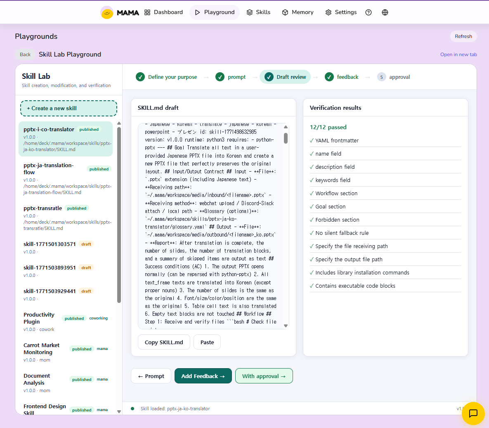

# Changelog

All notable changes to this project will be documented in this file.

## [Unreleased]

## [0.10.1] - 2026-02-22

### Added

- **Watchdog auto-restart**: Daemon process is now monitored by a watchdog that checks `/health` every 30s and auto-restarts on failure (max 10 restarts with exponential backoff)
- **`mama status` watchdog display**: Shows watchdog PID and active status
- **`mama stop` watchdog cleanup**: Watchdog is terminated before daemon shutdown to prevent restart during stop

### Changed

- **Timeout tuning**: Rebalanced all timeout values based on actual usage patterns
  - MCP request: 15min → 3min (single LLM call doesn't need 15min)
  - Agent response: 15min → 5min
  - Council round: 2min → 3min (prevent mid-discussion timeout)
  - Workflow step: 10min → 5min
  - Workflow total: 10min → 30min (multi-step DAG needs more headroom)
  - UltraWork total: 30min → 60min (autonomous work sessions need time)
  - UltraWork max steps: 20 → 50 (delegation + council consume steps fast)

## [0.10.0] - 2026-02-22

### Added

- **Code-Act Sandbox**: QuickJS WASM-based JavaScript sandbox engine
  - LLM agents can invoke gateway tools via code execution
  - Host Bridge: sandbox ↔ MAMA gateway tool bridge with Tier 1/2/3 permission differentiation
  - MCP Server: stdio `code_act` tool for direct use from Claude CLI
  - Type Definition Generator: auto-generates `.d.ts` per tool
- **MAMA Log Viewer**: Built-in HTML playground for real-time daemon log viewing
- **Daemon Log API**: `GET /api/daemon/logs` endpoint with `since` parameter and 304 support
- **Slack Send API**: `POST /api/slack/send` — Slack file/message sending parity with Discord
- **Backend-specific AGENTS.md**: Separate `AGENTS.claude.md` / `AGENTS.codex.md` injection per backend
- **Playground file_path**: Added `file_path` parameter to `playground_create` for large HTML support

### Changed

- **Tier differentiation**: Tier 2 = read-only + memory-write (`mama_save`/`mama_update`), Tier 3 = strictly read-only
- **Code-Act API**: Restricted to Tier 3 (read-only) permissions, authentication required
- **ESLint**: `no-explicit-any` rule enforced as error across all packages

### Fixed

- **Claude API contract**: `continue` no longer skips `results.push`
- **Tier Leak**: Missing `currentTier=1` reset in `else` branch
- **Path Traversal**: 4-layer validation on `/api/slack/send` to prevent directory traversal
- **Sensitive Files**: Block sensitive file types (`.db/.key/.pem/.env/.sqlite`) in Slack send
- **Resumed Sessions**: Prevent duplicate gateway tools injection on resumed sessions
- **Backend Fallback**: Sync `process.env.MAMA_BACKEND` on fallback
- **returnType accuracy**: Fixed 17 host-bridge tool returnTypes to match actual executor return shapes

### Dependencies

- `quickjs-emscripten@^0.32.0`
- `@jitl/quickjs-wasmfile-release-asyncify@^0.32.0`

## [0.9.5] - 2026-02-20

### Added

- **Playground Integration**: Skill Lab ↔ Skills Tab bidirectional integration
  - Playground viewer module with iframe embedding and Skills Tab sync
  - 3 built-in playgrounds: Skill Lab, Cron Workflow Lab, Wave Visualizer
  - Skill Registry API (`/api/skills/list`) for playground consumption
  - "Open in new tab" support for full-screen playground editing
  - 
- **Built-in Skill Templates**: 4 new skill templates (frontend-design, multi-agent-collab, playground, scheduling)
- **Tool Status Tracker**: In-place tool execution status updates in Viewer chat
  - Real-time tool progress display (running → completed/failed)
  - Gateway tool executor backend integration
- **Slack File Upload**: Shared attachment utilities for Discord/Slack file handling
  - `attachment-utils.ts` with `downloadAttachment`, `compressImage`, `detectImageType`
  - Deduplicated file upload logic across gateways

### Changed

- **Fail-Fast Policy**: Removed silent fallbacks, added explicit permission gates across standalone
- **AgentProcessPool Removed**: Simplified to direct process management (no pool_size)
- **Port Cleanup**: `mama start` ensures clean port release to prevent EADDRINUSE crashes

### Fixed

- **Timeout Propagation**: Agent timeout correctly passed through CLI wrapper
- **System Prompt Truncation**: Long system prompts no longer silently truncated
- **EADDRINUSE**: Restart no longer crashes when previous daemon port not released

## [0.9.4] - 2026-02-19

### Added

- **BMAD Workflow Integration**: Conductor PLAN mode generates BMAD-compliant workflow DAGs
  - Brainstorm, PRD, Architecture, Sprint Planning flows via `workflow_plan`
  - BMAD template engine with project-level awareness and output path computation
  - `is_planning_agent` flag for opt-in/opt-out BMAD injection per agent
- **Workflow Concurrency Limit**: Semaphore-based `max_concurrent_steps` (default 3) prevents rate limit hits
- **Backend Round-Robin Balancing**: Automatic claude ↔ codex-mcp load distribution across workflow steps
  - `backend_balancing` config option (default true)
- **Workflow Failure Feedback**: Conductor receives `[SYSTEM]` error message when plan validation or execution fails, enabling plan adjustment
- **Slack `slack_send` Gateway Tool**: Agents can send messages/files to Slack channels directly
- **Effort Level Support**: Claude 4.6 adaptive thinking effort (`--effort` flag) for Conductor and agents
- **Zombie Daemon Cleanup**: `killAllMamaDaemons()` kills orphaned daemon processes on start/stop

### Changed

- **Conductor Merge Policy**: Conductor no longer auto-merges PRs — must report verification results and await human `!merge` approval
- Hardcoded model IDs replaced with dynamic config resolution
- `--thinking-effort` CLI flag renamed to `--effort`
- `max_ephemeral_agents` default raised to 20

### Fixed

- **Raw JSON Leak**: Workflow plan JSON no longer leaks to Slack/Discord when plan execution fails
  - `extractNonPlanContent` now strips unfenced JSON plans
  - Fallback path in Slack/Discord handlers strips plan JSON before display
- **Codex MCP**: Spawn error fast detection + retry on failure; tilde expansion in `codexCwd`
- **BMAD Opt-Out**: Explicit `is_planning_agent: false` now correctly suppresses BMAD injection
- **Disabled Agent Skip**: `hasCodexBackendConfigured` skips disabled agents
- **YAML Error Handling**: `loadYamlFile`/`tryReadFile` throw on non-ENOENT errors instead of silent null
- **Slack Ghost Responses**: Message subtype events filtered to prevent duplicate responses
- **Settings UI**: Removed redundant `as any` casts in agent rendering

## [0.9.3] - 2026-02-18

### Added

- **UltraWork 3-Phase Loop (Ralph Loop)**: Restructured UltraWork from freeform loop to Plan→Build→Retrospective
  - Phase 1 (Planning): Lead agent creates implementation plan, optionally runs Council discussion
  - Phase 2 (Building): Executes plan via delegation loop, records each step to disk
  - Phase 3 (Retrospective): Reviews completed work, Council discussion for quality check
  - RETRO_INCOMPLETE triggers Build phase re-entry (max 1 retry)
  - File-based state persistence: `~/.mama/workspace/ultrawork/{session_id}/`
  - New `UltraWorkStateManager` class for session/plan/progress/retrospective CRUD
  - Config: `persist_state` (default: true), `phased_loop` (default: true)
  - Backward compatible: `phased_loop: false` preserves legacy freeform behavior
  - 24 new tests (8 phased loop + 16 state manager)
- **Council Engine**: Multi-round structured debates among named agents
  - Conductor outputs `council_plan` JSON block to initiate Council discussion
  - Configurable rounds (1-5), agent list, synthesis toggle
  - Progress updates in Slack/Discord per round
- **Onboarding multi-agent sync**: Phase 7b introduces all 5 agents + 4 coordination modes
  - Quick-start guide includes Multi-Agent System section
  - `handleSaveMultiAgent` auto-provisions persona files from templates
  - `provisionDefaults` copies missing persona files without overwriting existing ones

### Changed

- **Conductor persona**: Lead orchestrator renamed from Sisyphus to Conductor
  - Auto-migration: `sisyphus` config entries automatically converted to `conductor`
  - `default_agent: conductor` added to default multi-agent config
  - Updated metaphor from "roll the boulder" to orchestra/conductor theme
- Default agent model updated to `claude-sonnet-4-5-20250929`

### Fixed

- **Security**: Path traversal protection in UltraWork session IDs
- **Race condition**: TOCTOU fix in UltraWork state read-modify-write
- **Memory leak**: Lock cleanup comparison fix in UltraWorkStateManager
- **Retrospective validation**: isRetroComplete regex word boundary added
- **Workflow progress**: `completedSteps !== null` → `!== undefined` (Discord/Slack)

### Removed

- **PR Poller**: Removed ~1,200 lines of legacy PR polling code

## [0.9.2] - 2026-02-17

### Added

- **Dynamic Workflow Orchestration**: Conductor dynamically generates multi-step workflow DAGs from user requests
  - Ephemeral agents are spawned on-demand with custom system prompts, backends, and models
  - DAG-based execution with topological sort, parallel execution per level, and result interpolation
  - No pre-defined agents needed — Conductor designs the team for each request
  - Progress messages in Slack/Discord show agent name, model, and duration per step
  - Automatic cleanup of ephemeral agent processes after workflow completion
  - 30 unit tests for workflow engine (parsing, validation, cycle detection, execution)
- **Image type detection**: Discord gateway detects actual image media type from magic bytes
- **Configurable image analysis model**: ImageAnalyzer reads model from config instead of hardcoded value

### Fixed

- **Slack null message crash**: Fixed `Cannot read properties of undefined (reading 'replace')` in cleanMessageContent
- **Workflow timer leak**: Clear timeout after Promise.race settles in workflow step execution
- **Workflow duration measurement**: Capture full workflow execution time, not just Conductor response time
- **Workflow validation**: Add `display_name` validation and NPE guard in topologicalSort
- **Code style**: Add braces to single-line control statements, use DebugLogger instead of console.log

## [0.9.0] - 2026-02-15

### Added

- **Codex MCP backend**: New `codex-mcp` backend using MCP protocol instead of CLI wrapper
  - Proper threadId-based session management
  - compact-prompt parameter for context compaction control
  - Token usage tracking from MCP response metadata
- **Session busy queue**: Messages wait when session is processing, with `onQueued` notification
- **CI/CD improvements**: Turborepo for package-scoped builds and tests
  - Path-filtered test jobs (only run affected package tests)
  - Husky pre-commit uses turbo for faster checks

### Changed

- **Backend simplification**: Reduced to 2 backends (`claude` | `codex-mcp`)
  - Removed legacy `codex` CLI wrapper
  - Mixed agent support (Claude + Codex MCP in same conversation)
- **Session pool token tracking**: Disabled 160K threshold reset for Codex MCP (handles own compaction)
- **Viewer settings**: Added effort level selector for Codex models
- **WebSocket safety**: All `ws.send()` calls now use `safeSend()` helper with readyState check

### Fixed

- **MCP server startup**: Fixed timeout issue by using simple sleep instead of stdout wait
  - MCP protocol requires client to send first request
  - Added proper cleanup on initialization failure
- **PreToolUse hook**: Fixed decision display using `exit(2)` + stderr (additionalContext not supported)
- **Plugin hook search**: Simplified buildSearchQuery to filename tokens only (reduced noise)

## [mama-core-1.1.4] - 2026-02-15

### Added

- **safeSend helper**: WebSocket send with readyState guard and try-catch for race conditions
- **onQueued callback**: MessageRouter process() now supports busy queue notification

## [plugin-1.7.13] - 2026-02-15

### Changed

- **PreToolUse hook**: Use exit(2) + stderr for decision context (additionalContext not supported)
- **Search query**: Simplified to filename tokens only for better embedding relevance

### Removed

- **POC files**: Removed haiku-agent-poc.js and mcp-direct-poc.js

## [0.8.6] - 2026-02-14

### Changed

- **Viewer TypeScript migration**: Converted all viewer modules (chat, dashboard, graph, memory, settings, skills) from JavaScript to TypeScript
- **Typed API client**: New fully-typed API module with proper error handling
- **Plugin hook redesign**: PreToolUse triggers on Read (decision context), PostToolUse shows lightweight reminder

### Added

- **Viewer utilities**: DebugLogger, DOM helpers, format helpers, markdown renderer with DOMPurify
- **Test utilities**: `@jungjaehoon/mama-core/test-utils` export for isolated test databases
- **Session state**: Hook session isolation via SESSION_DIR environment variable

### Fixed

- **URL encoding**: All API path parameters now use encodeURIComponent
- **Hook performance**: Simplified hook logic, removed pattern detection

## [0.8.4] - 2026-02-14

### Fixed

- **Configuration loading diagnostics**: On startup, `~/.mama/config.yaml` parsing now surfaces a clear
  hint when cron expressions like `*/10 * * * *` are provided without quotes, avoiding silent
  startup failure and reducing recovery time.
- **Standalone/core API compatibility hardening**: Added startup-time normalization around `mama-core`
  memory API adapters used by context injection and scheduled jobs to guard against export-shape drift.

## [0.8.3] - 2026-02-14

### Fixed

- **Security: Symlink escape prevention** in `graph-api.ts` persona_file validation
  - Now uses `fs.realpathSync` to resolve symlinks before path validation
- **Security: MAMA_TRUSTED_ENV guard** enforced consistently in `discord.ts` setMultiAgentConfig
- **PR Review Poller**:
  - Fixed immediate reminder firing after initial report (`lastUnresolvedReminderAt` timing)
  - Added hot-reload support via `configurePrPoller()` helper
  - `sendMessage` now throws Error instead of silent return when sender is missing
- **Array input validation** in `normalizeDiscordGuilds` to prevent numeric key coercion

### Changed

- **DebugLogger migration**: Replaced `console.log/warn/error` with DebugLogger in:
  - `discord.ts` (init/permission diagnostics)
  - `multi-bot-manager.ts` (all logging)
- **ESM import**: Replaced `require()` with ESM import for DebugLogger in `start.ts`
- **Code style**: Added braces to all single-line if statements per coding guidelines
- **Test performance**: Added `MAMA_FORCE_TIER_3=true` in orchestrator tests to skip embeddings

## [0.8.2] - 2026-02-13

### Changed

- **LLM backend strategy updated (cost-aware)**:
  - Standalone onboarding/init now supports backend-agnostic selection (`auto | claude | codex`).
  - Motivation includes rising premium model operating costs (including Opus 4.6 tiers), so runtime
    backend choice is now user/environment-driven instead of vendor-fixed defaults.
  - New users can start with whichever authenticated CLI is available and switch later without
    architecture changes.
- **Embedding server ownership clarified**:
  - Standalone (`@jungjaehoon/mama-os`) is now the default owner of HTTP embedding runtime.
  - MCP server no longer starts HTTP embedding by default; legacy opt-in via
    `MAMA_MCP_START_HTTP_EMBEDDING=true`.
- **Port model unified**:
  - API/UI: `3847`
  - Embedding/chat runtime: `3849`
  - `MAMA_EMBEDDING_PORT` is primary; `MAMA_HTTP_PORT` remains backward-compatible alias for
    embedding runtime paths.
- **Dependency ownership cleanup**:
  - Direct `@huggingface/transformers` dependency removed from `mcp-server`,
    `claude-code-plugin`, and `openclaw-plugin`.
  - Embedding warmup and checks now go through `@jungjaehoon/mama-core` exports.

### Fixed

- **MCP legacy embedding port parsing**:
  - Invalid embedding port env values no longer produce `NaN` runtime behavior in
    `packages/mcp-server/src/server.js`; fallback to `3849` is enforced.
- **Docs/runtime command drift**:
  - Mobile/security/troubleshooting docs now consistently use `mama start` for MAMA OS runtime
    workflows and align systemd/PM2 examples with current startup model.

### Documentation

- Updated architecture, performance, reference, tutorial, installation, and troubleshooting docs
  to match current runtime boundaries and port responsibilities.

## [mama-core-1.1.0] - 2026-02-13

### Changed

- **TypeScript Migration**: Complete rewrite of all 30+ JS files to TypeScript
  - All source files now `.ts` with strict type checking
  - Exported type definitions for downstream consumers
  - Proper interface definitions for all public APIs
  - `tsconfig.json` added with strict mode configuration
  - CommonJS compatibility maintained via named exports

### Added

- **Type Interfaces**: 50+ new type definitions
  - `DecisionRecord`, `CheckpointRow`, `PreparedStatement`
  - `DeprecateAutoLinksResult`, `ScanAutoLinksResult`, `DeleteAutoLinksResult`
  - `CreateLinkBackupResult`, `RestoreLinkBackupResult`, `VerifyBackupResult`
  - `SaveParams`, `SaveResult`, `SearchResult`, `RecallResult`, `UpdateResult`
  - `SuggestOptions`, `SuggestResult`, `QualityReport`, `QualityRecommendation`
- **Runtime Validation**: Type guards for LLM response parsing
  - `isDecisionAnalysisResult()`, `isQueryIntentResult()` validators
- **Safety Guards**:
  - Cycle detection in supersedes chain walks (prevents infinite loops)
  - Nullish coalescing (`??`) for values where `0` is valid
  - Depth limits (MAX_CHAIN_DEPTH=1000) for graph traversals

### Fixed

- **WebSocket Security**: Internal error details no longer exposed to clients
- **Interval Leak**: try/finally now properly wraps interval lifetime
- **Cron Race Condition**: Graceful handling when job removed during execution

### Technical Debt

- Removed duplicate `PreparedStatement` interfaces (consolidated to `db-adapter/statement.ts`)
- Removed duplicate `DecisionRecord` interfaces (consolidated to `db-manager.ts`)
- Async/await annotations retained for future-proofing (sync SQLite adapter today)

## [0.8.0] - 2026-02-12

### Added

- **Webchat Media Upload**: Image/PDF upload with drag & drop, preview thumbnails, and Claude Vision integration
  - Supported formats: JPEG, PNG, GIF, WebP, SVG, PDF (20MB max, auto-compress >5MB)
  - `/api/upload` and `/api/media/:filename` endpoints
  - WebSocket `attachments` protocol for real-time image processing
- **TTS (Text-to-Speech)**: Auto-read assistant responses with voice
  - Toggle via speaker icon, speed control 0.5x-2.0x (default 1.8x for Korean)
  - Markdown/emoji stripping for clean speech output
  - Hands-free mode: auto-start STT after TTS completes
- **STT (Speech-to-Text)**: Voice input with auto-silence detection (2.5s)
  - Continuous recognition for multiple sentences
  - Auto language detection (Korean/English)
- **Image Analysis**: Claude Vision API integration via `ImageAnalyzer`
  - Singleton client caching for performance
  - Prompt injection sanitization (`sanitizeUserPrompt`)
  - Path validation to prevent LFI attacks
- **Hybrid MCP+Gateway Mode**: Both MCP servers and gateway tools can run simultaneously
  - `--mcp-config` and `--strict-mcp-config` flags passed to Claude CLI
  - Gateway tools (browser, media, PR review) available alongside MCP tools
  - Enables rich ecosystem: external databases, APIs via MCP + MAMA-native tools
- **Cron Job Lock Timeout**: 10-minute default lock timeout prevents stuck jobs
- **Dashboard Reorganization**: Agent selection in floating chat, session improvements
- **BaseGateway Abstract Class**: Deduplicated common gateway logic (Discord, Slack, Telegram)
- **Graph API**: `/api/graph/decisions`, `/api/graph/checkpoints` endpoints for decision visualization
- **Browser Tools**: `browser_open`, `browser_screenshot`, `browser_click` in gateway-tools.md
- **Lightbox Viewer**: Click images in chat to view full-size with zoom/pan

### Changed

- **Session Reset Warning**: Now bilingual (English + Korean)
- **System Prompt Optimization**: Gateway tools embedded directly to prevent truncation
- **DebugLogger**: Consistent logging across all modules (no more console.log)
- **Multi-Agent Free Chat**: Only responds to explicitly mentioned agents

### Fixed

- **Double Image Analysis**: Discord gateway now always clears contentBlocks after analysis
- **Port Conflict**: Stale process cleanup on startup
- **Prompt Overflow**: Enforced system prompt truncation and auto-session reset
- **Safari Compatibility**: Removed lookbehind regex patterns for iOS support
- **ESM Import**: Fixed `matchAll` with proper import syntax

### Security

- **LFI Prevention**: Server ignores client `filePath`, reconstructs from `filename` only
- **Filename XSS**: Sanitization with `escapeHtml` and `escapeAttr` for attribute contexts
- **Prompt Injection**: `sanitizeFilenameForPrompt` and `sanitizeUserPrompt` guards
- **Path Traversal**: `allowedBase` validation on all file operations
- **MCP Args Masking**: Sensitive arguments redacted in logs
- **MAMA_TRUSTED_ENV**: Hard gate for dangerous operations

### Removed

- **Gemini Workflows**: Removed unused `.github/workflows/gemini-*.yml` and `.github/commands/gemini-*.toml`

## [0.7.1] - 2026-02-12

### Fixed

- **Config preservation**: Custom config sections (scheduling, etc.) no longer lost on restart
- **Cron job persistence**: Jobs created via Settings UI now saved to config.yaml and survive restarts
- **Cron job loading**: Config-defined scheduling.jobs now loaded into scheduler on startup
- **Setup auth error**: Local requests no longer require MAMA_AUTH_TOKEN for config updates
- **Zombie process cleanup**: `mama stop` now kills processes holding ports 3847/3849

## [0.7.0] - 2026-02-12

### Added

- **Skill System**: Unified skill registry with 3 sources (MAMA, Cowork, External GitHub repos)
  - Skills Marketplace UI in Viewer (browse, install, toggle, search)
  - Agent auto-detects installed skills by keyword matching in system prompt
  - `mama init` copies default skill templates to `~/.mama/skills/`
  - Path traversal protection (`validateSkillName`) on all skill endpoints
- **Cron Scheduler**: Dashboard + Settings UI for scheduled job management
  - Create/edit/delete/toggle cron jobs from Viewer
  - Agent knows cron API via `gateway-tools.md` documentation
- **Token Tracker**: Per-agent token usage tracking with cost breakdown
  - Dashboard cards (today/week/month) with agent breakdown bars
  - `/api/tokens/summary` and `/api/tokens/by-agent` endpoints
- **Floating Chat**: Draggable/resizable chat panel overlay on all Viewer tabs
- **Codex Backend**: OpenAI Codex CLI as alternative agent backend
- **PR Review Workflow**: Multi-agent autonomous PR review with LEAD delegation
  - `pr_review_threads` gateway tool for agent autonomy
  - Background task delegation (`DELEGATE_BG`) with workspace isolation
  - Auto-checkout PR branch, parallel delegation, busy retry
- **Gateway Tools**: `pr_review_threads`, `pr_review_reply` for PR interaction
- **Work Tracker**: Agent task tracking across multi-agent delegation chains
- **Ecosystem Support**: Anthropic Cowork plugins, MCP servers, GitHub repos all installable via agent or UI

### Changed

- `SkillRegistry` constructor no longer requires `builtinSkillsDir` parameter
- `dangerouslySkipPermissions` defaults to `false` in Discord gateway
- Agent system prompt now includes all installed skill directives
- `console.*` replaced with `DebugLogger` in viewer modules and multi-agent-base
- README rewritten: removed "vibe coding" section, added skill/cron/ecosystem showcase

### Fixed

- `isAuthenticated(req)` check added to `POST /api/restart` and `PUT /api/config`
- `JSON.parse` wrapped in try/catch for `gh` CLI output in gateway-tool-executor
- PR review poller: `L` prefix formatting when line number is null
- PR review poller: `resolvedCount` accuracy with filtered thread subsets
- Lone surrogate stripping before sending to Claude API
- Multi-agent: prevent hallucinated file paths in delegation
- Agent message queue: drain on enqueue, correct agent cwd
- Stop command: properly kill lingering daemon processes

### Security

- Path traversal validation on all skill name inputs
- Source validation on DELETE/PUT skill endpoints
- CSRF protection via `isAuthenticated` on state-changing endpoints
- `dangerouslySkipPermissions` default hardened to `false`

## [0.6.1] - 2026-02-10

### Fixed

- Gateway Read tool file size guard (200KB limit) preventing 10MB+ prompt overflow from large files (e.g. daemon.log)
- Gateway Read tool parameter flexibility: accept `path`, `file_path`, and `file` to prevent agent hallucination from failed tool calls
- Gateway tools system info: replaced incorrect `systemctl` commands with `mama status/stop/start`
- Added tool call rules to prevent agent fabrication when tools fail

## [0.6.0] - 2026-02-10

### Added

- ESLint TypeScript support with `@typescript-eslint/parser` and `@typescript-eslint/eslint-plugin`
- TypeScript override in `.eslintrc.json` with `no-unused-vars`, `no-explicit-any` (warn), `no-require-imports` (warn)
- Typed Graph API (`graph-api.ts`) with `graph-api-types.ts` for all handler types
- `ContentBlock` interface for Claude stream protocol (`text`, `tool_use`, `tool_result`)
- `MultiAgentHandlerBase` abstract class extracting shared Discord/Slack infrastructure
- Authentication guard (`isAuthenticated`) on config-writing endpoints (`PUT /api/config`, `PUT /api/multi-agent/agents/:id`)
- Timing-safe token comparison (`crypto.timingSafeEqual`) to prevent side-channel attacks
- Input validation for agent config fields (tier, enabled, cooldown_ms, can_delegate)
- `safeParseJsonArray` for defensive JSON.parse on DB data

### Changed

- Lint scripts now include `.ts` files (`--ext .js,.mjs,.ts`)
- `lint-staged` unified to `*.{js,mjs,ts}` with eslint + prettier
- `format`/`format:check` scripts include `.ts` files
- `maskToken` standardized to `***[redacted]***` format with consistent `isMaskedToken` detection
- `dangerouslySkipPermissions` default changed from `true` to `false` in Discord gateway
- `body.confidence || 0.8` changed to `body.confidence ?? 0.8` (preserves zero)
- `body.outcome` uses `String()` instead of unsafe `as string` cast
- `start.ts` migrated `require('../../api/graph-api.js')` to ES import
- Redundant `require('fs'/'path'/'os'/'http')` calls removed across agent-loop.ts and start.ts
- `onboarding-state.ts` uses top-level `unlinkSync` import instead of inline `require`

### Fixed

- 70+ ESLint errors (no-unused-vars, prefer-const, no-useless-escape, no-empty, no-control-regex)
- 208 ESLint warnings (no-explicit-any, no-require-imports) suppressed with targeted disable comments
- Token masking mismatch: `isMaskedToken` regex now matches `maskToken` output format
- CORS headers centralized in `createGraphHandler` instead of per-route duplication
- `req.url` null guard before URL construction in graph handler
- Missing `afterEach` import in content-dedup.test.ts
- Missing `vi` import in yaml-frontmatter.test.ts
- Explicit `ChainState` return type on `MultiAgentHandlerBase.getChainState()`
- Pre-existing postinstall.test.js failure (empty config.json JSON.parse)

### Removed

- Outdated architecture docs (`docs/architecture-current-state-2026-02-08.md`, `docs/architecture-mama-swarm-2026-02-06.md`)
- Legacy `graph-api.js` (replaced by TypeScript `graph-api.ts`)

## [0.5.1] - 2026-02-09

### Fixed

- Plugin load error from agents entry in plugin.json

## [0.5.0] - 2026-02-08

### Added

- Multi-agent swarm system with 6-phase architecture
- Plugin hooks streamlining, OMC overlap removal
