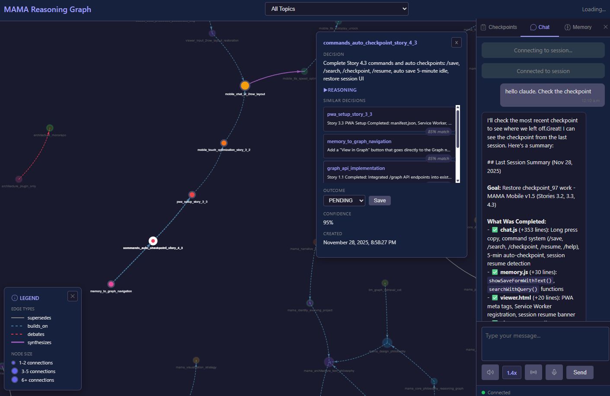
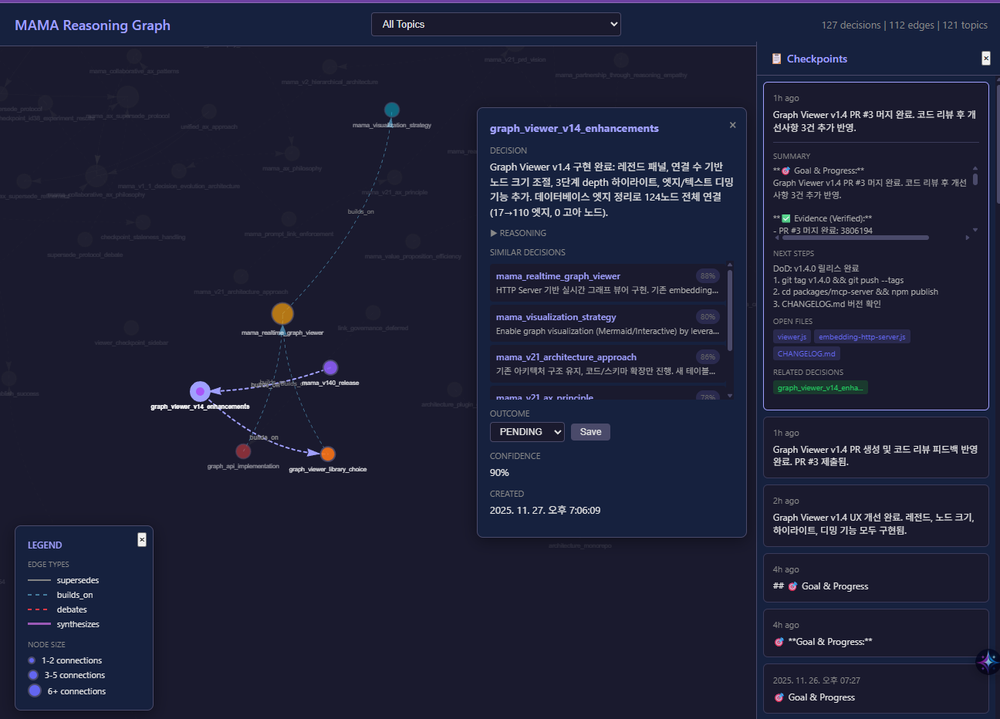
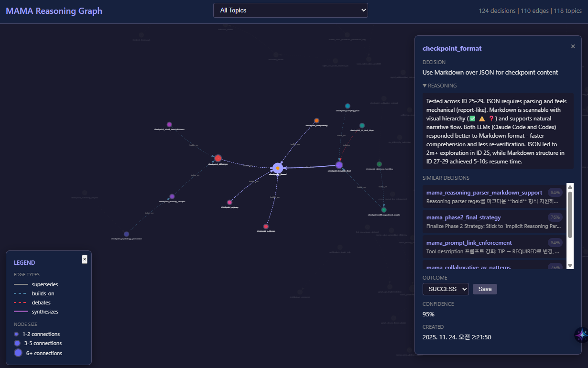

# Changelog

All notable changes to this project will be documented in this file.

The format is based on [Keep a Changelog](https://keepachangelog.com/en/1.1.0/),
and this project adheres to [Semantic Versioning](https://semver.org/spec/v2.0.0.html).

## [Unreleased]

### Added

**MAMA Mobile v1.5 - Real-time Mobile Chat with Enterprise Security**



#### Security & Authentication (v1.5.1)

- **Token Authentication** - `MAMA_AUTH_TOKEN` environment variable for external access
  - Bearer token + query parameter support
  - Automatic security warnings on external access detection
  - Localhost always allowed without authentication

- **Cloudflare Zero Trust Integration** - Production-grade security (RECOMMENDED)
  - Google/GitHub/Microsoft OAuth authentication
  - 2FA automatically enforced
  - Email restriction (only specific emails allowed)
  - Zero Trust architecture with automatic rate limiting
  - Complete setup guide in `docs/guides/security.md` (428 lines)

- **Feature Disable Options** - Security controls via environment variables
  - `MAMA_DISABLE_HTTP_SERVER` - Disable Graph Viewer + Mobile Chat
  - `MAMA_DISABLE_WEBSOCKET` - Disable Mobile Chat only (keep Graph Viewer)
  - Easy configuration via `/mama-configure` command

- **Enhanced /mama-configure Command** - One-command security management
  - `--disable-http` / `--disable-websocket` / `--enable-all`
  - `--generate-token` - Generate cryptographically secure token
  - `--set-auth-token=X` - Set authentication token
  - Shows security status (HTTP server, WebSocket, auth token)

#### Compatibility & Requirements (v1.5.1)

- **Mobile Chat Platform Compatibility** - Clear requirements documentation
  - ✅ Claude Code Plugin - Full support (uses `claude` CLI subprocess)
  - ❌ Claude Desktop (MCP) - Not supported (MCP servers only, no CLI)
  - Graph Viewer works in both environments
  - Requirements table added to README.md, mobile-access.md, api.md

#### Checkpoint API Implementation

- **POST /api/checkpoint/save** - Save session checkpoint with summary, open files, and next steps
- **GET /api/checkpoint/load** - Load latest active checkpoint for session resume
- Integrated with `mama.saveCheckpoint()` and `mama.loadCheckpoint()` functions

#### Story 3.2: Touch Optimization

- **Long press to copy** - 750ms press on messages to copy text
- **44px touch targets** - Mobile-optimized button sizing for all controls
  - Chat controls (Send, Voice, TTS, Mic)
  - Sidebar tabs
  - Memory save button

#### Story 3.3: PWA Support

- **PWA manifest** - Install MAMA Mobile as a standalone app
- **Service Worker** - Offline capability with static asset caching
- **App icons** - 192x192 and 512x512 PNG icons
- **Meta tags** - Mobile-optimized viewport, theme color, Apple touch icon

#### Story 4.3: Commands & Auto-Checkpoint

- **Slash commands** - `/save`, `/search`, `/checkpoint`, `/resume`, `/help`
  - Command parser in chat.js with prefix detection
  - Direct integration with Memory tab functions
- **Auto-checkpoint** - 5-minute idle timer with automatic session save
  - Idle detection with resetIdleTimer on user input
  - Auto-generates checkpoint summary from recent messages
- **Session resume UI** - Banner with "Resume" and "Dismiss" buttons
  - Auto-detect resumable sessions on page load
  - One-click restore of previous session context

#### File Changes

- `chat.js` (+353 lines) - Commands, long press, auto-checkpoint logic
- `memory.js` (+30 lines) - showSaveFormWithText, searchWithQuery
- `viewer.html` (+20 lines) - PWA meta tags, SW registration, resume banner
- `viewer.css` (+110 lines) - Banner styles, 44px touch targets
- `sw.js` - Extended STATIC_ASSETS cache list
- `viewer.js` (+5 lines) - dismissResumeBanner function
- `graph-api.js` (+140 lines) - Checkpoint save/load API endpoints

### Fixed

**Critical Bug Fixes (v1.5.1)** - Addressed code review feedback from gemini-code-assist

- **Language Auto-Detection** - Fixed hardcoded `ko-KR` in speech recognition
  - Now uses `navigator.language` for automatic browser language detection
  - Falls back to `ko-KR` if not available
  - TTS voice language also auto-detected from selected voice

- **Memory Leak Prevention** - Fixed cleanup() method not called on page unload
  - Added `beforeunload` event listener in `viewer.js`
  - Properly cleans up chat, memory, and graph modules
  - Prevents WebSocket connection leaks

- **WebSocket Session Management** - Fixed session ID parameter mismatch
  - Server expected `?session=xxx` but client sent `?sessionId=xxx`
  - Updated `websocket-handler.js:45` to use correct parameter name
  - WebSocket connections now properly attach to sessions

- **Service Worker 404 Errors** - Fixed missing PWA asset routes
  - Added routes for `/viewer/sw.js` and `/viewer/manifest.json`
  - Updated `graph-api.js:822-846` with proper asset serving
  - PWA installation now works correctly

- **Unknown Message Type Error** - Fixed missing WebSocket message handler
  - Added handler for `'connected'` message type in `chat.js:239-241`
  - Eliminates console errors on WebSocket connection

- **Status Display Bug** - Fixed null reference error in connection indicator
  - Changed `querySelector('span:last-child')` to `querySelector('span:not(.status-indicator)')`
  - Connection status now displays correctly in `chat.js:688`

- **Session Error Handling** - Added missing error response for expired sessions
  - Server now notifies client when session not found
  - Client auto-creates new session when old one expires
  - Updated `websocket-handler.js:115-127`

### Documentation

**Comprehensive Security & Configuration Guides (v1.5.1)**

- `docs/guides/security.md` (NEW) - Complete security guide (428 lines)
  - Cloudflare Zero Trust setup (8 steps, 15 minutes)
  - Token authentication (testing only)
  - Threat scenarios and mitigations
  - Security best practices

- `docs/guides/mobile-access.md` - Enhanced with configuration section
  - Requirements table (Mobile Chat = Claude Code only)
  - Cloudflare Zero Trust as Option 1 (Production - RECOMMENDED)
  - Quick Tunnel + Token as Option 2 (TESTING ONLY)
  - `/mama-configure` command examples
  - Manual plugin configuration for both Claude Code and Claude Desktop

- `README.md` - Added security and configuration sections
  - Mobile Chat requirements table
  - Security warning about full system compromise
  - Cloudflare Zero Trust as recommended production method
  - Configuration examples with `/mama-configure`

- `docs/reference/api.md` - Added Mobile Chat compatibility table
  - Platform compatibility matrix (Claude Code vs Claude Desktop)
  - Clear note about CLI requirement

- `packages/claude-code-plugin/commands/configure.md` - Enhanced command
  - Added 6 new security/configuration options
  - Security settings display in command output

---

## [1.4.5] - 2025-11-27

### Improved

**Graph Viewer UX Enhancements**



- **Checkpoint Sidebar**: Always-visible timeline panel showing session checkpoints
- **Draggable Detail Panel**: Decision detail panel can be dragged by title
- **Custom Scrollbars**: Thin 6px dark-themed scrollbars (webkit + Firefox)
- **Layout**: Detail panel positioned left of checkpoint sidebar (no overlap)

---

## [1.4.4] - 2025-11-27

### Added

- **Checkpoint Timeline Sidebar**: `/checkpoints` API endpoint + sidebar UI
- **Expandable Checkpoint Items**: View timestamp, summary, open files, next steps
- **Related Decision Links**: Click to navigate to decisions referenced in checkpoints

---

## [1.4.3] - 2025-11-27

### Fixed

- **Port Environment Variable**: Unified to support both `MAMA_HTTP_PORT` and `MAMA_EMBEDDING_PORT`

---

## [1.4.2] - 2025-11-27

### Added

- **MAMA_HTTP_PORT**: Environment variable for custom HTTP server port (default: 3847)
- Enables dual WSL/Windows environments to use different ports

---

## [1.4.1] - 2025-11-27

### Fixed

- **npm Package**: Include CSS/HTML files in published package (`src/**/*.css`, `src/**/*.html`)

---

## [1.4.0] - 2025-11-27

### Added

**Graph Viewer** - Interactive visualization of your reasoning graph.



#### Features

- **Interactive Graph Visualization**: vis.js-powered network graph with physics simulation
- **Legend Panel**: Visual guide for edge types (supersedes, builds_on, debates, synthesizes) and node sizes
- **Node Size by Connections**: Nodes scale based on connection count (1-2: small → 11+: large)
- **3-Depth Highlight**: Click a node to highlight connected nodes up to 3 levels deep with BFS traversal
- **Dimming Effect**: Unconnected nodes/edges fade to 10% opacity when a node is selected
- **Topic Filter**: Dropdown to filter graph by topic
- **Detail Panel**: View full decision details, reasoning, similar decisions, and update outcomes
- **Similar Decisions**: Shows semantically similar decisions with similarity percentages
- **Outcome Update**: Quick save of decision outcomes (SUCCESS/FAILED/PARTIAL) from the detail panel

#### Endpoints

| Endpoint  | Description                                   |
| --------- | --------------------------------------------- |
| `/viewer` | Interactive graph visualization UI            |
| `/graph`  | JSON API returning nodes, edges, and metadata |

#### Technical Details

- Built on existing HTTP embedding server (port 3847)
- No additional dependencies (vis.js loaded from CDN)
- Real-time graph updates via REST API
- Dark theme optimized for extended viewing

---

## [1.3.1] - 2025-11-26

### Changed

**AX-Focused Tool Descriptions** - Enhanced tool descriptions for better LLM guidance.

- **⚡ TRIGGERS**: Added Korean/English trigger phrases to each tool
  - save: "기억해줘", "remember", "decided", "결정했어"
  - search: "뭐였더라", "what did we decide", "이전에"
  - update: "이거 안됐어", "this didn't work", "성공했어"
  - load_checkpoint: "이어서", "continue", "where were we", "지난번"

- **🔗 Workflow Hints**: Cross-tool connection guidance
  - save: "Call 'search' first to find related decisions"
  - load_checkpoint: "Call 'search' to refresh related decisions after loading"

- **💡 TIP**: Best practice hints embedded in descriptions
  - "High similarity (>0.8) = likely related, consider linking"
  - "Include 'builds_on: <id>' or 'debates: <id>' to link decisions"

---

## [1.3.0] - 2025-11-26

### Added

**Collaborative Reasoning Graph** - Decisions now form a connected graph through explicit relationships.

#### Epic 1: Collaborative Save

- **Auto-search on save**: When saving a decision, MAMA automatically searches for similar existing decisions
- **similar_decisions**: Returns up to 2 related decisions with similarity scores
- **collaboration_hint**: Suggests how to relate new decisions (build-on, debate, synthesize)
- **reasoning_graph**: Shows topic depth and latest decision in chain

#### Epic 2: Reasoning Graph Edges

- **New edge types**: `builds_on`, `debates`, `synthesizes` (in addition to existing `supersedes`, `refines`, `contradicts`)
- **Reasoning field parsing**: Auto-detects edge references in reasoning text
  - Pattern: `builds_on: decision_xxx`, `debates: decision_yyy`, `synthesizes: [id1, id2]`
- **Edge-connected search results**: Related decisions appear with `related_to` and `edge_reason` fields
- **Multi-agent collaboration**: Edge types track decision evolution across multiple LLM sessions. During v1.3 development, multiple LLMs debated protocol design choices, with `debates` and `synthesizes` edges recording the reconciliation process.

#### Epic 3: AX Polish

- **Case-insensitive outcome**: `update` tool accepts `success`, `SUCCESS`, `failed`, `FAILED`, `failure` etc.
- **Enhanced tool descriptions**: Added COLLABORATION MODES and 5-LAYER REASONING guidance

### Changed

- **Search result ordering**: Primary results followed by their edge-connected decisions (interleaved)
- **Edge approval default**: Auto-detected edges are approved by default (`approved_by_user=1`)

### Database

- **Migration 010**: Extended `decision_edges` CHECK constraint to include new edge types

---

## [1.2.4] - 2025-11-25

### Fixed

- **Checkpoint Save Bug**: Fixed `Too few parameter values` error when saving checkpoints via `save` tool

---

## [1.2.3] - 2025-11-25

### Changed

- **Enhanced All Tool Descriptions**: All 4 MCP tools now have context-aware descriptions based on actual usage patterns
  - `save`: 4-section checkpoint format, 5-layer decision narrative
  - `search`: Use cases (prior art, context after checkpoint, debugging), decision evolution inference
  - `update`: Real-world validation timing (days/weeks later), failure learning importance
  - `load_checkpoint`: Staleness warning, verification-first workflow

---

## [1.2.2] - 2025-11-25

### Added

- **5-Layer Narrative Guide in Tool Descriptions**: LLMs now see structured format guides even without slash commands
  - Checkpoint `summary`: 4-section format (🎯 Goal & Progress, ✅ Evidence, ⏳ Unfinished & Risks, 🚦 Next Agent Briefing)
  - Checkpoint `next_steps`: DoD and verification commands hint
  - Decision `reasoning`: 5-layer narrative (Context, Evidence, Alternatives, Risks, Rationale)

### Fixed

- **Search Tool Bug**: Fixed `decisions.map is not a function` error when `suggest()` returns null

---

## [1.2.1] - 2025-11-25

### Changed

- **Plugin Commands Simplified**: 7 commands → 5 commands with shorter names

| Old Command        | New Command        | Notes                     |
| ------------------ | ------------------ | ------------------------- |
| `/mama-save`       | `/mama:decision`   | Shorter, clearer          |
| `/mama-recall`     | `/mama:search`     | Unified with suggest/list |
| `/mama-suggest`    | `/mama:search`     | Unified                   |
| `/mama-list`       | `/mama:search`     | Use without query         |
| `/mama-checkpoint` | `/mama:checkpoint` | Same                      |
| `/mama-resume`     | `/mama:resume`     | Same                      |
| `/mama-configure`  | `/mama:configure`  | Same                      |

- **Command Naming**: Changed from `/mama-*` to `/mama:*` format (plugin namespace)

### Documentation

- `docs/reference/commands.md`: Rewritten for 5 simplified commands

---

## [1.2.0] - 2025-11-25

### Why This Release?

**The Core Insight: LLM Can Infer Relationships**

MAMA v1.1 added 11+ MCP tools including link governance (propose/approve/reject). But analysis revealed:

- 366 auto-generated "refines" links were 100% cross-topic noise
- Only "supersedes" edges (same topic) were reliable
- LLM can infer refines/contradicts relationships from time-ordered search results

**Design Principle:** Fewer tools = more LLM flexibility. More tools = more constraints.

### Breaking Changes

**MCP Tools reduced from 11 to 4:**

| Old Tool (v1.1)     | New Equivalent (v1.2)           |
| ------------------- | ------------------------------- |
| `save_decision`     | `save` with `type='decision'`   |
| `save_checkpoint`   | `save` with `type='checkpoint'` |
| `recall_decision`   | `search` with query             |
| `suggest_decision`  | `search` with query             |
| `list_decisions`    | `search` without query          |
| `update_outcome`    | `update`                        |
| `load_checkpoint`   | `load_checkpoint` (unchanged)   |
| `propose_link`      | **Removed**                     |
| `approve_link`      | **Removed**                     |
| `reject_link`       | **Removed**                     |
| `get_pending_links` | **Removed**                     |

### Changed

- **MCP Tool Consolidation**: 11 tools → 4 tools (save, search, update, load_checkpoint)
  - `save`: Unified tool with `type` parameter ('decision' or 'checkpoint')
  - `search`: Unified tool - semantic search with query, list recent without query
  - `update`: Simplified outcome update
  - `load_checkpoint`: Unchanged

- **Auto-Link Generation Removed**: `decision-tracker.js` no longer creates refines/contradicts edges
  - LLM infers relationships from time-ordered search results
  - Only supersedes edges remain (same topic, automatic)

- **Tool Descriptions Enhanced**: Added supersedes concept to help new LLMs understand evolution tracking
  - "Same topic = new decision supersedes previous, creating evolution chain"

### Removed

- **Link Governance Tools**: propose_link, approve_link, reject_link, get_pending_links
- **Auto-Link Code**: Functions for generating refines/contradicts edges
- **406 Noise Links**: Migration 009 removed all refines (366) and contradicts (40) links

### Added

- **HTTP Embedding Server**: Shared embedding service for fast hook execution
  - MCP server runs HTTP embedding server on `127.0.0.1:3847`
  - Model stays loaded in memory - ~150ms hook latency (vs 2-9s before)
  - Endpoints: `/health`, `/embed`, `/embed/batch`

- **Migration 009**: `009-remove-auto-links.sql` for cleaning noise links
- **listCheckpoints API**: `mama.listCheckpoints()` for unified search

### Documentation

- `docs/reference/api.md`: Complete rewrite for 4-tool architecture
- `docs/reference/commands.md`: Added MCP tool mappings
- `docs/explanation/decision-graph.md`: Updated edge types (supersedes only)
- `CLAUDE.md`: Updated MCP Tools section
- `README.md`: Updated to v1.2.0 with new tool catalog

---

## [1.1.0] - 2025-11-25

### Why This Release?

**The Core Problem with v1.0: "It remembered, but couldn't be trusted"**

MAMA v1.0 could save and search decisions, but had three fundamental issues:

1. **Link Noise Problem**: Auto-generated links created more noise than signal. LLMs indiscriminately created connections that polluted search results, making it impossible for users to distinguish meaningful relationships from spurious ones.

2. **Context Loss Problem**: The "what" was saved, but the "why" was lost. Looking at `auth_strategy: JWT` three months later, you couldn't know why that choice was made, what alternatives were considered, or what risks were accepted.

3. **Restart Cost Problem**: When sessions broke, you had to re-explain everything from scratch. Agents failed to restore previous context, or restored it incompletely.

### What v1.1 Solves

| Problem            | v1.0                        | v1.1                                                                     |
| ------------------ | --------------------------- | ------------------------------------------------------------------------ |
| Link Trust         | LLM auto-generation (noisy) | Propose→Approve flow (user verified)                                     |
| Decision Context   | Only topic + decision       | 5-layer narrative (evidence, alternatives, risks, reasoning, continuity) |
| Session Continuity | Manual restoration          | Zero-context restart (28ms)                                              |
| Quality Tracking   | None                        | Auto-generated coverage/quality reports                                  |
| Legacy Cleanup     | No tools                    | Safe migration utilities                                                 |

### Expected Benefits

- **Link Precision**: Only approved links affect search → Target 95% noise reduction
- **Decision Reusability**: Fully understand "why that decision" even 3 months later
- **Agent Handoff**: No context loss when another agent takes over
- **Quality Visibility**: Instantly see which decisions lack narrative depth

---

### Use Cases: How to Experience the Changes

#### Use Case 1: Trustworthy Links (Link Governance)

**Before (v1.0)**: Search results included dozens of auto-generated links, most irrelevant.

**After (v1.1)**:

```bash
# LLM proposes a link (not yet active)
mama.propose_link(from="auth_strategy", to="security_audit", reason="JWT choice affects audit scope")

# You review and approve only meaningful ones
mama.get_pending_links()  # See what's proposed
mama.approve_link(from="auth_strategy", to="security_audit")  # Approve

# Now searches only return approved, high-quality links
mama.suggest("authentication")  # Clean results, no noise
```

#### Use Case 2: Complete Decision Context (5-Layer Narrative)

**Before (v1.0)**:

```
topic: database_choice
decision: PostgreSQL
# That's it. Why PostgreSQL? What else was considered? Unknown.
```

**After (v1.1)**:

```bash
mama.save(
  topic="database_choice",
  decision="PostgreSQL with read replicas",
  reasoning="Need ACID compliance for financial transactions, plus read scaling for analytics",
  evidence=["benchmark_results.md", "compliance_audit_2025.pdf"],
  alternatives="Considered MongoDB (rejected: no ACID), MySQL (rejected: weaker JSON support)",
  risks="Operational complexity of replica lag management"
)

# 3 months later, everything is preserved:
mama.recall("database_choice")
# Returns full context: why, what else, what risks, what evidence
```

#### Use Case 3: Zero-Context Restart (Session Continuity)

**Before (v1.0)**: New session = start over, re-explain project context.

**After (v1.1)**:

```bash
# End of session - save state
mama.save_checkpoint(
  summary="Implemented auth module, blocked on rate limiter design",
  next_steps="1. Research token bucket vs leaky bucket 2. Check Redis compatibility"
)

# New session (even different agent)
mama.load_checkpoint()
# Returns in 28ms:
# - Recent decisions with full narrative
# - Related links (approved only)
# - Exactly where you left off
```

#### Use Case 4: Quality Monitoring (Coverage Reports)

**New in v1.1**:

```bash
mama.generate_quality_report()

# Output:
# Narrative Coverage: 45% (55/122 decisions have complete narrative)
# Link Coverage: 78% (95/122 decisions have at least one link)
#
# Recommendations:
# - 67 decisions missing evidence/alternatives/risks
# - 27 decisions have no connections to other decisions
```

#### Use Case 5: Safe Legacy Cleanup (Migration Tools)

**For existing v1.0 users**:

```bash
# Step 1: See what would be cleaned
mama.scan_auto_links()
# Shows: 458 auto-links found, 42 protected (have approval)

# Step 2: Backup first
mama.create_link_backup()
# Saved to ~/.claude/mama-backups/links-backup-2025-11-25.json

# Step 3: Clean with dry-run
mama.deprecate_auto_links(dry_run=True)
# Preview: Would remove 416 links, keep 42 approved

# Step 4: Execute
mama.deprecate_auto_links(dry_run=False)

# Step 5: Verify
mama.validate_cleanup_result()
# SUCCESS: Remaining auto-link ratio 3.2% (target: <5%)
```

---

### Technical Deep Dive: AI-to-AI Communication Architecture

> **Key Insight**: MAMA is fundamentally an **AI-to-AI communication system**.
> The prompts and injected context are designed to guide one LLM instance (current session)
> using decisions made by previous LLM instances (past sessions), with human approval as the trust layer.

#### 1. The AI-to-AI Communication Model

```
┌─────────────────┐     ┌─────────────────┐     ┌─────────────────┐
│   LLM (Past)    │────▶│     MAMA DB     │────▶│  LLM (Current)  │
│  Session N-1    │     │  + Embeddings   │     │   Session N     │
└─────────────────┘     └─────────────────┘     └─────────────────┘
        │                       │                       │
        │ Writes decisions      │ Stores with           │ Receives context
        │ with reasoning        │ vector embeddings     │ via hook injection
        │                       │                       │
        ▼                       ▼                       ▼
   "I chose JWT          Semantic search         "Previous session
    because..."          finds relevant           chose JWT for
                         past decisions           scaling reasons"
```

**The Human Role**: Not the primary audience, but the **trust gatekeeper**

- Approves/rejects LLM-proposed links
- Confirms decision saves
- Reviews checkpoint honesty

#### 2. Decision Prompts: Guiding LLM Output Quality

**Tool Description Prompt** (what the LLM sees when saving):

```
save_decision: Save a decision to MAMA's memory for future reference.

IMPORTANT - Graph Connectivity: Reuse the SAME topic name for related
decisions to create decision graphs. Example: Use 'auth_strategy' for ALL
authentication decisions, not 'auth_strategy_v1', 'auth_strategy_v2'.

Parameters:
- topic: Decision topic identifier. Use lowercase with underscores.
         REUSE SAME TOPIC for related decisions to create supersedes edges.

- reasoning: Why this decision was made. This is REQUIRED - never leave empty.
             Explain the context, alternatives considered, and rationale.
             IMPORTANT: Use English for better semantic search.
```

**Prompt Effectiveness Assessment:**

| Prompt Element                 | Intent             | Actual Behavior   | Gap?                               |
| ------------------------------ | ------------------ | ----------------- | ---------------------------------- |
| "REQUIRED - never leave empty" | Force reasoning    | LLMs comply       | No                                 |
| "Reuse SAME topic"             | Graph connectivity | Inconsistent      | Yes - LLMs often create new topics |
| "Use English"                  | Better embeddings  | Usually followed  | No                                 |
| "lowercase with underscores"   | Consistent naming  | Sometimes ignored | Minor                              |

**Known Prompt Gaps:**

1. **Topic Reuse**: Despite explicit instruction, LLMs often create `auth_v2` instead of reusing `auth`
2. **Evidence Format**: No strict format → varied quality (some paths, some prose)
3. **Confidence Calibration**: LLMs tend toward 0.8-0.9 regardless of actual certainty

#### 3. Checkpoint Prompts: Honest AI-to-AI Handoff

**Verification Prompt** (injected when checkpoint command detected):

```
You're saving a checkpoint - a message to the NEXT AI that will continue this work.

Write honestly so the next session can understand and continue effectively.

## Common Oversights

**Before writing "complete":**
- Did you include file paths? (e.g., db-manager.js:354)
- Did you run tests? (npm test)
- Did you re-read the AC? (you might have missed something)

**Be honest about incomplete work:**
- "I didn't finish this part"
- "I skipped this because..."
- "I forgot about..."

It's okay. Just write it down.
```

**Checkpoint Schema Prompt** (tool description):

```
save_checkpoint: Save the current session state.

Required format (be honest, include unfinished work):
1) Goal & Progress: What was the goal and how far did you get?
2) Evidence: Files/logs/commands + status [Verified | Not run | Assumed]
3) Unfinished & Risks: Remaining work, unrun tests, risks/unknowns
4) Next Agent Briefing: Definition of Done + quick commands to run

Before saving: scan for TODOs or missing tests and state them plainly.
```

**Prompt Effectiveness Assessment:**

| Prompt Element                     | Intent               | Actual Behavior    | Gap? |
| ---------------------------------- | -------------------- | ------------------ | ---- |
| "message to NEXT AI"               | Frame as handoff     | Improves structure | No   |
| "[Verified \| Not run \| Assumed]" | Explicit status      | Often omitted      | Yes  |
| "scan for TODOs"                   | Pre-save check       | Rarely done        | Yes  |
| "be honest about incomplete"       | Reduce optimism bias | Noticeably better  | No   |

**Known Prompt Gaps:**

1. **Status Tags**: LLMs frequently write prose instead of `[Verified]` tags
2. **TODO Scanning**: Instruction exists but LLMs don't actually grep for TODOs
3. **File Paths**: Sometimes generic ("the auth file") instead of specific

#### 4. Context Injection: How Past AI Informs Current AI

**Hook Output Format** (injected into LLM context on every user message):

```
MAMA found 3 related topics:

1. auth_strategy (88% match)
   "Use JWT with refresh tokens for stateless auth"
   3 days ago | Recency: 95% | Final: 90%
   mama.recall('auth_strategy')

2. session_management (82% match)
   "Redis for session storage with 24h TTL"
   5 days ago | Recency: 90% | Final: 85%

---
System Status: Tier 1 | 287ms | 3 decisions injected
```

**Design Rationale:**

- **Teaser Format**: Shows preview only → LLM must explicitly request full context
- **Recall Command**: `mama.recall('topic')` teaches LLM how to get more
- **Recency Score**: Gaussian decay (σ=30 days) → older decisions fade
- **Transparency Line**: LLM knows injection happened (no hidden context)

**Injection Effectiveness Assessment:**

| Design Choice                | Intent           | Actual Behavior       | Gap?  |
| ---------------------------- | ---------------- | --------------------- | ----- |
| Preview only (60 chars)      | Reduce noise     | Works well            | No    |
| `mama.recall()` hint         | Teach retrieval  | LLMs sometimes ignore | Minor |
| Similarity threshold 0.6-0.7 | Relevance filter | Good balance          | No    |
| 500 token budget             | Prevent overflow | Never exceeded        | No    |

#### 5. Session Restore: Complete AI-to-AI Context Transfer

**load_checkpoint Output Structure:**

```json
{
  "data": {
    "checkpoint": {
      "id": 65,
      "summary": "Implemented auth module, blocked on rate limiter",
      "open_files": ["src/auth/jwt.js", "tests/auth.test.js"],
      "status": "active"
    },
    "narrative": [
      {
        "topic": "auth_strategy",
        "decision": "JWT with refresh tokens",
        "reasoning": "Stateless for horizontal scaling...",
        "evidence": ["benchmark.md", "security-review.pdf"],
        "alternatives": ["Session cookies (rejected: stateful)"],
        "risks": "Token theft if not using httpOnly",
        "outcome": "SUCCESS",
        "confidence": 0.9
      }
    ],
    "links": [
      {
        "from_id": "decision_auth_123",
        "to_id": "decision_security_456",
        "relationship": "refines",
        "reason": "Auth choice affects audit requirements",
        "approved_by_user": true
      }
    ],
    "nextSteps": {
      "unfinished": ["Rate limiter design pending"],
      "recommendations": ["Research token bucket vs leaky bucket"],
      "risks": ["Token theft without httpOnly"]
    }
  }
}
```

**5-Layer Narrative Structure:**

| Layer       | Field                   | AI-to-AI Purpose                                  |
| ----------- | ----------------------- | ------------------------------------------------- |
| Specificity | `decision`              | What was decided (unambiguous)                    |
| Reasoning   | `reasoning`             | Why (enables current AI to understand trade-offs) |
| Evidence    | `evidence`              | Proof (current AI can verify)                     |
| Tension     | `alternatives`, `risks` | What was rejected (prevents re-exploration)       |
| Continuity  | `outcome`, `links`      | How it connects (graph traversal)                 |

#### 6. Link Governance: Human-in-the-Loop Trust

**The Problem**: AI-to-AI links without validation = noise amplification

**v1.1 Solution**: Proposal → Human Approval → Active

```
Current LLM: "I notice auth_strategy relates to security_audit"
             mama.propose_link(from="auth_strategy", to="security_audit",
                               relationship="refines",
                               reason="JWT choice affects audit scope")

System: Link saved as PENDING (approved_by_user = false)
        → Does NOT appear in searches
        → Does NOT influence recall results
        → Waits for human review

Human: mama.approve_link(from="auth_strategy", to="security_audit")
       # Link now ACTIVE - appears in searches, affects recall

System: Link approved (approved_by_user = true)
        → Now included in search results
        → Contributes to context injection
```

**Trust Flow Summary:**

```
LLM Proposes → User Reviews → User Approves/Rejects → System Enforces
     ↑                              ↓
     │                    Only approved links
     │                    affect AI behavior
     │                              ↓
     └──────── Feedback ──────────┘
```

#### 7. Summary: The Complete Trust Pipeline

```
┌────────────────────────────────────────────────────────────────────────┐
│                     MAMA v1.1 AI-to-AI Trust Pipeline                  │
├────────────────────────────────────────────────────────────────────────┤
│                                                                        │
│  ┌─────────────┐    ┌─────────────┐    ┌─────────────┐                │
│  │ LLM Writes  │───▶│   Human     │───▶│ LLM Reads   │                │
│  │  Decision   │    │  Approves   │    │  Context    │                │
│  └─────────────┘    └─────────────┘    └─────────────┘                │
│        │                  │                  │                         │
│        │ Prompts guide    │ Links gated      │ Injection format        │
│        │ structure        │ by approval      │ guides retrieval        │
│        │                  │                  │                         │
│        ▼                  ▼                  ▼                         │
│   5-layer narrative   Only approved      Preview + recall hint         │
│   required fields     links active       teaches next AI               │
│                                                                        │
├────────────────────────────────────────────────────────────────────────┤
│  Trustworthiness Factors:                                              │
│  ✓ Reasoning required (not optional)                                   │
│  ✓ Links require human approval                                        │
│  ✓ Checkpoints prompt honesty                                          │
│  ✓ Quality metrics surface gaps                                        │
│  ⚠ Topic reuse inconsistent (prompt gap)                               │
│  ⚠ Status tags often omitted (prompt gap)                              │
└────────────────────────────────────────────────────────────────────────┘
```

---

### Added

#### Environment & Deployment (Epic 1)

- **Workspace Installation**: pnpm workspace monorepo structure verified
- **Environment Variables**: `MAMA_DB_PATH`, `MAMA_SERVER_TOKEN` standardized
- **Token Masking**: Sensitive data protection in logs (`server.js:64-90`)
- **MCP Tool Catalog**: Complete tool documentation in `docs/reference/api.md`

#### Narrative Preservation (Epic 2)

- **5-Layer Narrative**: `evidence`, `alternatives`, `risks` fields in save_decision
- **Search Narrative Tool**: `search_narrative` for semantic search across narrative fields
- **Zero-Context Restart**: `load_checkpoint` returns full/summary/minimal context modes

#### Link Governance (Epic 3)

- **Proposal Flow**: `propose_link`, `approve_link`, `reject_link`, `get_pending_links`
- **Link Metadata**: `created_by`, `approved_by_user`, `decision_id`, `evidence`, `reason`
- **Audit Trail**: Append-only `link_audit_log` table with timestamps

#### Quality Metrics (Epic 4)

- **Coverage Report**: `generate_quality_report` with narrative/link coverage metrics
- **Restart Metrics**: `get_restart_metrics` with p50/p95/p99 latency tracking
- **Thresholds**: Configurable targets with automatic recommendations

#### Migration Tools (Epic 5)

- **Scan**: `scan_auto_links` identifies v0 auto-generated links
- **Backup**: `create_link_backup` with SHA-256 checksums
- **Cleanup**: `execute_link_cleanup` with batch processing and transactions
- **Validate**: `validate_cleanup_result` with success criteria evaluation

#### Documentation (Epic 6)

- **MCP Protocol Spec**: `docs/reference/api.md` with request/response formats
- **Deployment Guide**: `docs/guides/deployment.md` for release workflow
- **Migration Guide**: `docs/guides/migration-v0-to-v1.1.md` for v0 users

### Changed

- **Link Policy**: Auto-generation → Proposal + Approval model
- **Token Masking**: Enhanced protection in all log outputs
- **Error Format**: Standardized `{error: {code, message, details}}`

### Deprecated

- **Auto-generated links**: v0 auto-links flagged for removal
- Links without `approved_by_user=true` excluded from searches

### Fixed

- Embedding memory leak in long-running sessions
- Race condition in concurrent checkpoint saves

### Security

- Token masking in all log outputs
- PII protection (email partial masking)
- File path home directory masking (`~/...`)

---

## [1.0.2] - 2025-11-22

### Fixed

- MCP server startup error on Windows
- SQLite connection pool exhaustion

---

## [1.0.1] - 2025-11-21

### Fixed

- Plugin postinstall script path resolution
- Hook timing issues on slow systems

---

## [1.0.0] - 2025-11-21

### Added

- Initial release of MAMA monorepo
- **MCP Server** (`@jungjaehoon/mama-server`):
  - `save_decision` - Save decisions with embeddings
  - `recall_decision` - Retrieve by topic
  - `suggest_decision` - Semantic search
  - `list_decisions` - Browse all decisions
  - `update_outcome` - Track decision outcomes
  - `save_checkpoint` / `load_checkpoint` - Session continuity
- **Claude Code Plugin** (`mama`):
  - `/mama-save` - Save decision command
  - `/mama-recall` - Recall by topic
  - `/mama-suggest` - Semantic suggestions
  - `/mama-list` - List decisions
  - `/mama-checkpoint` - Save session state
  - `/mama-resume` - Resume session
  - `/mama-configure` - View/modify settings
- **Auto-context injection**: UserPromptSubmit and PreToolUse hooks
- **Tier transparency**: System status display (Tier 1/2/3)
- **Local-first**: SQLite + sqlite-vec for embeddings
- **Multilingual support**: Xenova/multilingual-e5-small model

### Technical

- pnpm workspace monorepo structure
- 597+ tests (unit, integration, regression)
- Node.js >= 18.0.0 required

---

[Unreleased]: https://github.com/jungjaehoon-lifegamez/MAMA/compare/v1.2.1...HEAD
[1.2.1]: https://github.com/jungjaehoon-lifegamez/MAMA/compare/v1.2.0...v1.2.1
[1.2.0]: https://github.com/jungjaehoon-lifegamez/MAMA/compare/v1.1.0...v1.2.0
[1.1.0]: https://github.com/jungjaehoon-lifegamez/MAMA/compare/v1.0.2...v1.1.0
[1.0.2]: https://github.com/jungjaehoon-lifegamez/MAMA/compare/v1.0.1...v1.0.2
[1.0.1]: https://github.com/jungjaehoon-lifegamez/MAMA/compare/v1.0.0...v1.0.1
[1.0.0]: https://github.com/jungjaehoon-lifegamez/MAMA/releases/tag/v1.0.0
