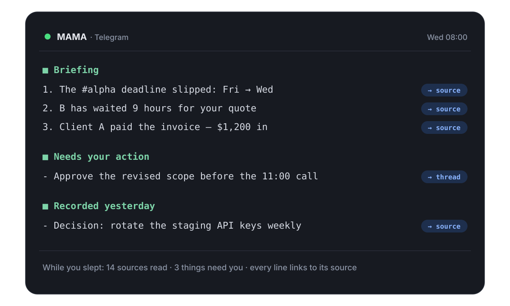

# MAMA OS

[](https://opensource.org/licenses/MIT)
[](https://nodejs.org)
[](packages/memorybench/)
[](https://github.com/jungjaehoon-lifegamez/MAMA)

> Right now, you read every channel yourself so nothing slips past you.
> MAMA reads them instead, and sends you the few things that need you.
> Every claim links to its source.



## The product is a message that arrives

You pick the hours. At those hours, in Telegram, Slack, or Discord:

```text
■ Briefing — Wed 08:00
1. Client A sent the revised files overnight                  → source
2. The #alpha deadline moved from Friday to Wednesday         → source
3. B's question about invoice terms is 14 hours unanswered    → source

■ Needs your action
- Approve the revised scope before the 11:00 call             → thread

■ Recorded yesterday
- Decision: rotate the staging API keys weekly                → source
```

The names are made up. The format is exactly what it sends.

Nobody asked for that message. Overnight, a daemon on your machine read 14
sources: Slack, Telegram, Gmail, Trello, Sheets, an Obsidian vault, and more.
It decided what needed you, and wrote it down with links.

It also did the small work already. The task board updated itself from those
same conversations. Lasting decisions were saved to memory. The wiki wrote its
daily page.

## What that replaces

- The morning scan across channels that mostly did not change.
- Scrolling back to find out when that deadline moved, and who said so.
- The handoff note you have to write before you step away.

And three things it is **not**:

- Not a chatbot with good memory. It runs while nobody is talking to it.
- Not a memory database. Storage is the input; the report is the product.
- Not a hosted service. There is no MAMA account and no MAMA server. It runs on
  the logins you already have.

## Why not a task agent, or your chat app's AI?

Both exist and both are good. They just answer a different question.

- **A task coworker finishes work you already know about.** You still have to notice that
  the deadline moved before you can delegate it. MAMA's job is to notice for you.
- **A chat integration reads Slack when you ask.** But your clients are on Chatwork,
  iMessage, and Telegram DMs. MAMA reads fourteen sources, including the messy ones where
  the money actually talks.
- **Both start from zero every time.** MAMA keeps a record on your disk and answers from
  it, with the source message linked. It does not run a new search that forgets everything
  afterwards.
- **Neither can say "still unanswered after three days."** To say that, you must remember
  yesterday. MAMA remembers. A scheduled summary starts fresh every time and has nothing to
  compare against.

## Built to be checked, not believed

A system that acts on its own must be easy to check afterwards.

- **No source, no claim.** Every change MAMA makes is saved together with the events
  that caused it. If it cannot name a cause, the change is saved as _unattributed_.
  The database rejects any row that fakes a cause.
- **It drafts; you send.** An agent can write the customer reply from the
  evidence, but sending requires an explicit permission for that destination.
  Memory writes refuse anything shaped like a secret.
- **Your record stays on your machine.** The databases are local SQLite and the
  embeddings are computed locally. Network traffic goes to two places only: the
  services you connected (Slack, Gmail, and so on) and your AI provider, through
  the official `claude` or `codex` CLI you already logged into. Nothing is ever
  uploaded to a MAMA server, because there is none.
- **Search shows its work.** Strict mode drops a semantic match that has no text or
  entity evidence behind it. A wrong answer that merely sounds right gets rejected,
  not displayed.

More detail: [Architecture](docs/explanation/architecture.md) ·
[Security guide](docs/guides/security.md)

## Quick start

**The daemon** — the full product:

```bash
claude auth login            # or: codex login — your existing CLI auth is reused
npx @jungjaehoon/mama-os init
mama start                   # daemon at localhost:3847
```

Operator board at `http://localhost:3847/ui`: live report slots, the trigger
library, and a task board fed from your channels. Chat surfaces: Discord,
Slack, Telegram. Requires Node >= 22 and an authenticated
[Claude Code](https://claude.ai/claude-code) or
[Codex](https://www.npmjs.com/package/@openai/codex) CLI.

**Claude Code plugin** — decision memory for coding sessions. It works without the
daemon; one hook (conversation ingestion at compaction) uses the daemon when it is
running, and skips quietly when it is not:

```bash
/plugin install mama
/mama:search "authentication strategy"
```

**MCP server** — Claude Desktop or any MCP client:

```json
{ "mcpServers": { "mama": { "command": "npx", "args": ["@jungjaehoon/mama-server"] } } }
```

## The pieces

| Package                                       | What it is                                                                                                     | You run it?          |
| --------------------------------------------- | -------------------------------------------------------------------------------------------------------------- | -------------------- |
| [mama-os](packages/standalone/) 0.29.2        | The daemon: connectors, trigger loop, reports, task board, web UI. 92k lines. "MAMA" means this.               | `mama start`         |
| [mama-core](packages/mama-core/) 2.0.0        | The library underneath: memory, provenance, graph, embeddings. Everything imports it; it imports nothing here. | No binary            |
| [mama-server](packages/mcp-server/) 1.15.0    | A deliberately thin MCP adapter over the core — 3.7k lines, no logic of its own.                               | As an MCP server     |
| [plugin](packages/claude-code-plugin/) 1.11.0 | Claude Code hooks + slash commands. No background process.                                                     | Installed, not run   |
| [memorybench](packages/memorybench/) 1.0.0    | The benchmark harness behind the retrieval numbers.                                                            | To reproduce a score |

Dependency direction is one-way: nothing depends on the daemon.

## Our numbers, including the bad ones

- **93.0%** on a 100-question LongMemEval tool-use sample (Sonnet 4.6, fully
  local) — above SuperMemory (81.6%), below Mastra (94.87%).
  [Reproduce it](packages/memorybench/).
- **84% of trigger-authoring passes create nothing.** A duplicate gate rejects
  near-copies of triggers that already exist. That is correct, but a loop this idle
  should at least say why it declined.
- **Cache reuse is 15.9x** per built context, against 144.8x for a comparable system
  on the same machine. This is our biggest known cost problem.
- **3 of 18 recent changes carried a cause.** Honest, but low. Most runs are
  autonomous and have no owner message to cite. We plan to raise it, not excuse it.

## Roadmap

|                    |                                                                                                                                                           |
| ------------------ | --------------------------------------------------------------------------------------------------------------------------------------------------------- |
| Done (v0.15–v0.28) | Search overhaul → connector framework → the operator runtime → owner console → durable workorder pipeline. Full history in the [CHANGELOG](CHANGELOG.md). |
| **Now (v0.29)**    | Evidence and effects: every durable change names its cause, or admits it has none.                                                                        |
| Next               | Eight concrete items, unpacked below.                                                                                                                     |
| v1.0               | Team mode: a shared, scoped knowledge graph. General release.                                                                                             |

Each "Next" item comes from a measurement, or from a competitor doing it better:

- **Stable prompt prefixes for the autonomous lanes.** Cache reuse is 15.9x against a
  comparable system's 144.8x. One prompt cut (231 KB → 57 KB) already halved per-call
  cost. The same discipline applies to the report and board lanes.
- **Alarms for the daemon's own silence.** The authoring step once died for three days
  before anyone noticed. A scheduled job that misses its slot repeatedly should page the
  owner, and every subprocess death should record its exit code and output.
- **Causes for the autonomous lanes.** Most changes are made by runs nobody prompted. A
  board run should receive its event window as the cause of what it changes, the way work
  orders already do.
- **Zero-yield authoring that says why.** 84% of authoring passes create nothing. A pass
  that declines should record what it rejected, and a near-duplicate should strengthen the
  existing trigger instead of vanishing.
- **A surface that can only answer "nothing" fails the build.** Two shipped APIs turned out
  to be permanently empty. The drift guard that now covers the tool catalog generalizes to
  every advertised surface.
- **An approval inbox.** Taken from OpenWorker: when the owner is away, the system queues
  the decision instead of raising its own authority.
- **Permissions you can explain in one sentence.** Also from OpenWorker: label every
  action as read, write-local, or external-send. And state the standing rule up front:
  _external sends never happen without explicit permission, by design._
- **A first briefing in the first five minutes.** Taken from Claude's Slack integration:
  one connector, first poll, first report. The product should prove itself before anyone
  has to believe anything.

## Development

```bash
git clone https://github.com/jungjaehoon-lifegamez/MAMA.git
cd MAMA && pnpm install && pnpm build
pnpm test     # 4,958 tests across five packages
```

Guidelines in [CLAUDE.md](CLAUDE.md). _Last updated: 2026-07-30_

## License

MIT
