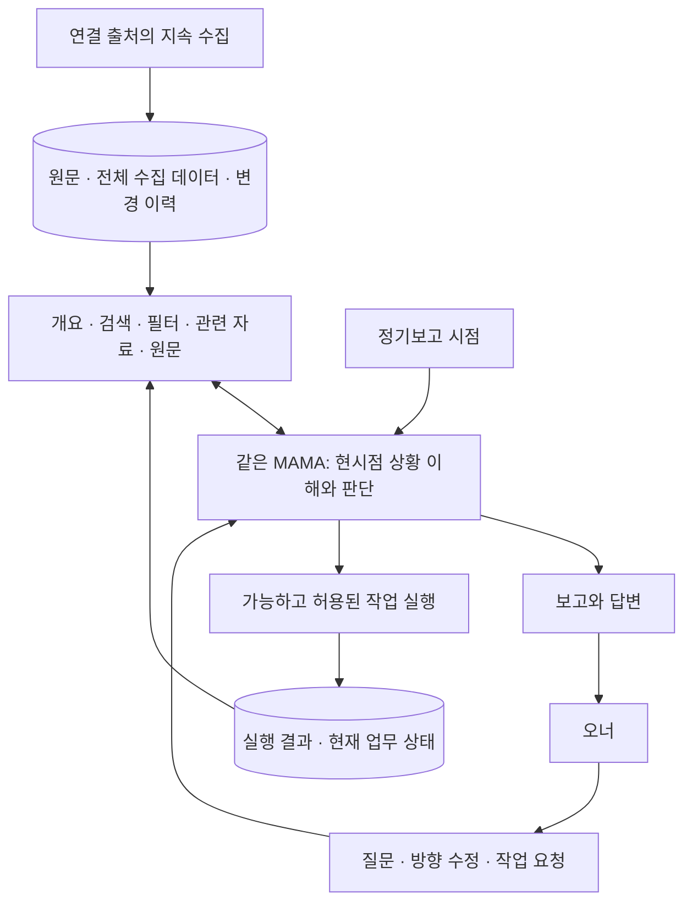
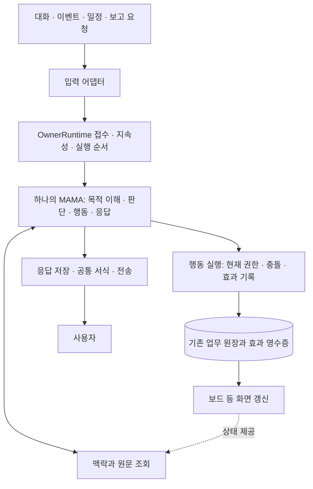
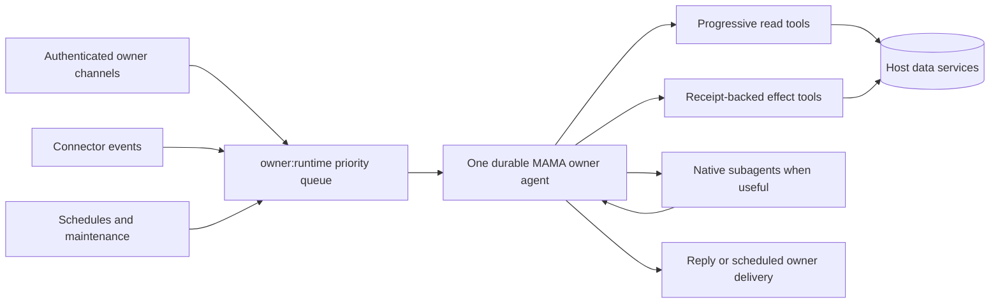

# One MAMA owner runtime — 전체 실행 구조 재설계

설계 버전: 4 · 2026-09-07 · 상태: 설계 반영, 런타임 전환 미구현
기준: [제품 목적](../../INTENT.md). 적용 시나리오: TG-01/03/04/05/06.
이 절이 현재 목표 구조다. 아래 과거 설계와 구현 기록은 전환 전의 근거이며 현재 완료 상태가 아니다.

## 최상위 설계 축 — 축적·점진 접근·현재 이해·보고·상호작용·실행

사용자가 명시한 전체 목적은 데이터를 축적하고, MAMA가 쉽게 점진적으로 접근하여
현시점을 이해하고 오너에게 보고하며, 같은 맥락에서 질문과 가능한 작업 요청을 처리하는 것이다.
정기보고와 대화·실행은 같은 제품 흐름이다. 앞선 v2의 대화 중심 해석과 v3의 보고 중심
축소를 이 계약으로 대체한다.

### 2026-09-07 구현 전환 상태

보고 실행 경계부터 전환 중이다. `ReportRunInput`은 보고 종류·prompt·sourceMessageRef를
필수로 받고 `PersonaReportAsk.compose` 하나로 실행한다. 문자열 호출과 full 전용 진입을
제거했다. full/digest 모두 생성 전에 PendingReportRequest를 저장하고, 실패 후 같은
deliveryId를 복원한다. 빈 최종 응답을 앞선 assistant 문장으로 대체하는 폴백을 삭제했다.
이는 보고 실행 계약의 전환이며 데이터 가공과 전체 구조 전환 완료가 아니다. 아직 설치하지 않았다.

현재 원문 계약에서 확인한 전환 과제:

- `RawStore.save`는 동일 source_id의 본문을 유지하고 provenance 일부만 갱신한다.
- calendar/drive는 버전이 반영된 sourceId를 생성하지만 slack/notion은 고정 ID를 사용한다.
- 따라서 sourceId가 원본 대상인지 불변 관측 버전인지 공통으로 정의돼 있지 않다.
  각 connector의 수정·삭제 수집 지원과 함께 entity ID / observation ID를 분리해야 한다.
- polling-scheduler는 raw 저장 후 들어온 scopedItems를 rawIndexSink에 전달한다.
  저장된 원문과 색인 입력이 같은 불변 관측을 가리키는지 보장하는 계약이 필요하다.
- 최근 발췌 저장, 원문 축적, 업무 상태 갱신, 보고 범위와 전송 진행은 서로 다른 상태다.
  보고 전송 복구가 먼저 실행되어 delta 소비를 지연시키는 연결도 분리 대상이다.

### 데이터 축적과 접근의 계약

- 연결·수집 범위의 원문과 버전 이력을 보존한다. 보고용 bounded window는 접근의
  시작점이며 전체 데이터 저장소를 대체하지 않는다. 전체 수집 범위와 공백을 노출한다.
- 원문 저장과 파생 개요·색인·업무 상태를 구분한다. 요약은 원문 참조와 근거 버전을
  가지며, 원문 변경 시 오래된 판단임을 알 수 있어야 한다.
- 접근은 출처/기간/업무 개요 → 검색·필터 → 관련 항목 → 원문 순으로 깊어질 수 있다.
  이것은 사용 가능한 탐색 방식이며 호스트가 도구 순서를 강제하는 실행 절차가 아니다.
- 조회 결과는 일관된 ID, 시각, 원문 참조, pagination/coverage, 최신성 정보를 제공한다.
  도구마다 서로 다른 식별자와 숨은 선행 호출을 요구하지 않도록 기존 조회 도구를 정리한다.
- 전체 데이터를 매 실행에 주입하지 않는다. 필요한 부분만 조회하면서 원문까지 도달할
  수 있게 한다. 발췌에서 빠졌다는 이유로 자료가 없다고 결론짓지 않는다.
- 현재 상태는 발생 시각과 관측 시각, 적용 기간, 수정·취소·삭제 관측을 고려해 계산한다.
  과거 이력은 유지하고 최신값만으로 설명에 필요한 변화 과정을 지우지 않는다.

### 보고에서 질문과 실행으로 이어지는 계약

정기보고에는 기준 시점과 주요 근거 참조를 남긴다. 오너의 후속 질문은 그 보고를
참조하되, 이후 변화가 있으면 현재 자료를 추가 조회하여 보고 당시와 지금을 구분한다.
오너가 요청한 가능한 작업은 같은 MAMA가 현재 권한과 도구로 수행한다. 실행 결과는
업무 원장과 관련 기록에 반영되어 다음 보고의 변화 근거가 된다. 보고 문장을 실행
영수증으로 취급하지 않고, 질문 응답 성공을 데이터 가공·정기보고의 성공으로 대신하지 않는다.

### 현재 경로와 바뀌어야 할 가공

`connectors/framework/polling-scheduler.ts`와 `raw-store.ts`에서 시작하여,
`operator-trigger-loop.ts`가 delta를 소비하고 `SituationReporter.recordWindow`가
채널별 건수·최근 발췌와 trigger 결과를 누적한다. full/digest는 서로 다른 composition
호출 경로를 가진다. 최근 발췌는 탐색의 시작점이지 업무 전체를 대표하는 판단 자료가 아니다.

| 단계      | 입력을 무엇으로 가공하는가                                       | 책임                                                     |
| --------- | ---------------------------------------------------------------- | -------------------------------------------------------- |
| 수집      | 원본 ID·버전·발생 시각·관측 시각·수집 성공 범위를 가진 원문      | 기존 connector와 raw store                               |
| 변경 식별 | 신규·수정·취소·삭제 관측과 이전 버전의 차이, 원문 참조           | 결정적 코드; 관측 부재를 삭제로 추정하지 않음            |
| 업무 통합 | 같은 업무의 여러 출처, 담당·기한·의존 관계·상충 근거             | MAMA가 기존 task/wiki/기억에 연결; 추측성 자동 병합 금지 |
| 상태 갱신 | 현재 사실과 미해결 항목, 판단의 근거·시점                        | MAMA; 관측 자체를 무조건 task로 만들지 않음              |
| 보고 판단 | 이전 보고 이후 변화 + 미완료 업무 + 다가오는 일정 + 수집 공백    | 같은 MAMA; 최근 이벤트만으로 판단하지 않음               |
| 작성·전달 | 중요도에 따라 정리한 보고와 출처, 저장된 본문, Telegram entities | 내용은 MAMA, 서식·분할·재전송은 호스트                   |

이 단계들은 데이터 책임의 구분이다. 단계마다 별도 모델·심사자·고정 도구 호출을 만들지 않는다.
폴링마다 전체 자료를 다시 읽지 않고 바뀐 원문과 관련 업무를 연결한다. 보고 시각에는
준비된 현재 상태에서 시작해 판단에 필요한 원문만 추가 조회한다.

### 정기보고 회차의 계약

- 보고 회차는 예정 시각·시간대·대상 기간·보고 종류로 식별한다. 재시도에도 동일 회차다.
- 회차 시작 시 출처별 수집 위치와 최신성, 비교할 이전 보고를 기록한다. 작성 중 새로
  들어온 데이터는 다음 회차로 넘기거나 이번 회차에 포함했음을 기준에 기록한다.
- 수집 cursor, 업무 가공 위치, 보고가 포함한 범위, 전송 상태를 서로 구분한다.
  한 단계의 성공으로 나머지 단계가 처리됐다고 표시하지 않는다.
- 전달된 이전 보고와 비교하되, 이미 작성했지만 전송 중인 보고도 보존하여 재작성·중복 전송을 막는다.
- 보고 내용은 핵심 변화, 업무 현황, 남은 문제·다음 일정, 필요한 결정으로 구성한다.
  고정 개수를 채우거나 근거 없는 추천을 만들지 않는다.
- 새 이벤트가 없어도 미해결 업무·기한·수집 상태를 판단한다. 정기보고 회차를
  단순 hasActivity 조건만으로 생략하지 않는다. 무변화 시 전달 정책은 사용자의 설정을 따른다.
- 수집이 늦은 출처가 있으면 그 범위를 밝히고 가능한 보고를 만든다. 전송 복구가
  다음 폴링·가공을 막지 않도록 분리한다.

### 현재 구현 계획의 우선순위 수정

1. 실제 폴링→원문→delta→업무 상태→report 입력의 producer/consumer를 추적하고,
   각 단계에서 버려지는 맥락·중복 처리·재조회 원인을 구체화한다.
2. 기존 원문·업무 원장·보고 저장소에서 변경분과 업무 맥락, 보고 간 비교 기준을 연결한다.
   별도의 중복 판단 데이터베이스를 먼저 만들지 않는다.
3. full/digest가 이 자료를 공통으로 사용하도록 가공·판단 경로를 통합한다.
4. 그 흐름에 필요한 occurrence/복구/화면 분리/서식을 아래 실행 구조에 따라 구현한다.
   데이터 접근·정기보고·후속 질문·실행의 연결을 유지하며 어느 한쪽으로 목적을 축소하지 않는다.
5. 질문을 보내지 않은 상태에서 여러 번의 폴링과 정기보고를 이어 확인한다. 수정·취소,
   중복 수집, 무변화·미완료 업무, 출처 지연, 재시작과 전송 재시도를 포함한다.
   성공 기준은 현시점의 정기보고, 근거를 더 찾는 후속 질문, 가능한 작업 실행, 다음 보고의 결과 반영까지 이어지는 흐름이다.

## 구조적 문제

현재 공통 세션은 있지만 공통 실행 주체의 진입 계약은 없다. `owner-runtime.ts`의
`OwnerRuntimeRunner(prompt, channelId)`는 목적·발생 식별자·재개 정보 없이 문자열만 받는다.
`start.ts`, `report-run.ts`, `operator-trigger-loop.ts`, `workorder-consumer.ts`,
`owner-event-loop.ts`가 각자 실행 맥락을 만들고 모델 진입·실패·재시도를 결정한다.

그 결과 coalescing key를 효과 발생 ID로 재사용하고, 이미 확정된 행동을 이유로 다음 업무를
막으며, 보고 종류별로 identity가 누락되고, 보드 렌더링이 모델 실행의 선행 조건이 된다.
이것은 개별 조건문의 문제가 아니라 수명과 책임이 서로 다른 것들을 한 실행에 묶은 문제다.
근거는 [차단 검사 조사](runtime-blocking-check-audit.md)에 있다.

## 목표 구조

호스트에 새 planner, reviewer, 업무별 판단 에이전트를 추가하지 않는다. 기존 AgentLoop와
owner queue를 재사용한다. 도구 순서, 필요 자료, 업무 완료 판단은 MAMA가 선택한다.
화면 생성과 전송에는 별도 모델 호출이 필요하지 않다.

## 책임과 인터페이스

| 구성             | 맡는 책임                                                      | 제거할 책임                                             |
| ---------------- | -------------------------------------------------------------- | ------------------------------------------------------- |
| 입력 어댑터      | 인증된 입력을 발생 정보·내용·답변 목적지로 변환                | 별도 모델 실행 옵션, 업무별 도구 정책, 전체 실행 재시도 |
| OwnerRuntime     | 입력을 먼저 저장, 기존 큐에 접수, attempt 시작, 재개 맥락 제공 | 업무 분해·도구 순서·결과 심사                           |
| MAMA / AgentLoop | 의도·현재 업무·자료를 연결해 판단하고 행동                     | 채널별 별도 주체, 매 실행 전체 이력 재주입              |
| 행동 실행 계층   | 해당 행동의 권한·현재 버전·중복과 결과 처리                    | 과거 효과 때문에 전체 추론 차단                         |
| 맥락 조회        | 범위에 맞는 원문·기억·최신성 제공                              | 존재하지 않는 대체 도구로 유도하는 거절                 |
| 화면·전송        | 원장 변경 반영, 응답 저장, 서식·분할·재전송                    | 실패 시 업무 판단 전체 재실행                           |

새 접수 계약은 `submit(stimulus)` 하나다. stimulus는 신뢰된 어댑터가 작성하며
`principalRef`, `occurrenceId`, `sourceRef`, `receivedAt`, `contentRef`,
선택적 `objectiveRef`, `replyTarget`, `coalesceKey`를 갖는다. 도구 순서는 포함하지 않는다.
content와 원문은 권한 지시로 승격하지 않는다. 접수 결과는 접수 ID와 현재 처리 상태이며
접수 성공을 업무 완료라고 표시하지 않는다. envelope, modelRunId, attempt는 runtime이 생성한다.

## 서로 다른 네 가지 수명 (TG-04/05/06)

- **목적**: 여러 대화와 실행에 걸쳐 이어진다. 기존 task와 대화 journal을 참조한다.
  모든 대화를 task로 만들거나 별도의 목적 데이터베이스를 추가하지 않는다.
- **발생 occurrence**: 같은 요청의 재전달·재시도에는 유지하고 새로운 요청에는 새로 부여한다.
  Telegram update, event, 예약 회차 등 원본 식별자를 우선 사용한다.
- **시도 attempt**: occurrence를 처리하는 매 시도마다 달라진다. 재시작 복구는 새 시도다.
- **효과 action**: 발생·대상·행동·정규화 인자·의도된 버전에 연결한다. 같은 시도 안의
  의도적인 반복 행동은 별도 action ID를 갖고, 재시도는 기존 ID를 이어간다.

`board:full:repair` 같은 coalesceKey는 대기 중의 유사한 신호를 합치는 용도다.
효과 ID나 업무 완료 ID로 사용하지 않는다. 새 변화가 실행 중 도착하면 후속 발생을 남긴다.

## 정상 흐름과 실패의 범위

정상 흐름은 접수 → MAMA 판단·행동 → 결과 저장 → 전달이다. 독립 심사나 추가 모델 검증은
필수 단계가 아니다. 각 도구는 자신의 실행 결과를 반환하고 MAMA가 필요에 따라 확인한다.

| 상황                      | 처리 범위                                           | 계속 가능한 일              |
| ------------------------- | --------------------------------------------------- | --------------------------- |
| 인증할 수 없는 입력       | owner 세션 접수 거절                                | 기존 owner 업무             |
| 허용 범위를 벗어난 행동   | 그 행동만 거절하고 사용 가능한 범위 반환            | 허용된 조회·다른 행동       |
| 확정된 동일 행동 재요청   | 기존 영수증 반환                                    | 다음 판단·다음 행동         |
| 외부 효과 결과 불명       | 해당 효과 조회·조정, 확인 없이 재전송 금지          | 독립적인 조회·판단·행동     |
| 임의 shell 실행 결과 불명 | 영향 범위가 없으면 충돌 가능 mutation 보류          | 안전한 읽기·진단, 복구 선택 |
| 보드 생성 실패            | projection 상태를 실패/오래됨으로 기록, 별도 재시도 | 원장 조회·업무·답변         |
| Telegram 전송 실패        | 저장된 응답만 재전송; 결과 불명은 확인 후 처리      | 업무 결과와 다른 입력 처리  |
| 실행 시간/자원 소진       | 진행 위치 저장, 양보 후 필요시 재개                 | 다른 대기 입력              |

권한은 입력 source/workKind가 아닌 현재 principal grant에서 결정한다. 만료된 실행 envelope는
현재 grant로 재발급하고 실제 변경 직전에 적용한다. grant 회수는 즉시 해당 행동에 반영한다.
반복된 동일 실패·진전 없는 루프는 중단할 수 있지만 성공한 CodeAct 호출 8회 같은
업무 종류별 상한은 제거한다. 시간·토큰 예산은 작업을 잃지 않는 양보/재개 정책으로 통합한다.

## 맥락과 사용자 응답 (TG-01/03/05/06)

원문 조회는 요약·범위·최신성에서 필요한 세부 내용으로 확장한다. scoped checkpoint 조회를
실제 제공하거나, 지원되는 복구 조회를 명확히 제공한다. 차단된 도구끼리 안내를 순환시키지 않는다.
세션이 유지되면 이력을 재주입하지 않는다. 실제 세션 교체 시 목적·미완료 상태·관련 영수증·
원문 참조만 제한적으로 복원한다.

full/digest/수동 요청은 출력 요구의 차이이며 같은 접수·판단 경로를 사용한다. 응답은 한 번
저장하고 스트리밍·최종·자동 보고가 공통 Telegram formatter를 사용한다. Kagemusha의
HTML→entities, UTF-16 위치, 분할과 edit/send 경로를 기준으로 이식한다.
전송 실패를 이유로 보고 내용을 다시 생성하거나 업무 효과를 재실행하지 않는다.

## 기존 코드의 통합·삭제 지도

| 현재 위치                                                            | 전환                                                                              |
| -------------------------------------------------------------------- | --------------------------------------------------------------------------------- |
| `operator/owner-runtime.ts`, `cli/commands/start.ts`                 | 문자열 runner를 실제 접수 서비스로 확장; start는 서비스 연결만 담당               |
| `operator/report-run.ts`, `operator/operator-trigger-loop.ts`        | full/digest 공통 stimulus; pending report는 전송/발생 상태를 보관                 |
| `operator/workorder-consumer.ts`, `operator/owner-event-loop.ts`     | claim·스케줄 정보는 유지, 자체 모델 진입 검사·재실행 결정은 공통 runtime으로 이동 |
| `operator/task-ledger.ts`                                            | occurrence와 attempt 보존; coalescing과 effect identity 분리                      |
| `operator/owner-action-effects.ts`, `agent/gateway-tool-executor.ts` | 기존 영수증을 재사용하고 행동 단위 복구; broad unsafe-replay 진입 차단 제거       |
| `agent/temporal-code-act-breaker.ts`, `agent/agent-loop.ts`          | 종류별 성공 호출 상한 삭제; 공통 자원/진전 관리 사용                              |
| `envelope/enforcer.ts`, `agent/mama-tool-handlers.ts`                | 실제 데이터 접근 경계와 scoped 복구 도구 일치                                     |
| board renderer와 consumer 연결                                       | 원장 revision 기반 갱신; render 실패가 실행을 차단하는 연결 삭제                  |
| `gateways/telegram*.ts`                                              | 단일 formatter와 저장된 응답 전송 경로 사용                                       |

경로는 `packages/standalone/src/` 기준이다. 새 계층 뒤에 기존 모델 호출·guard를 그대로
남겨두면 전환으로 인정하지 않는다. 최종적으로 owner 모델 호출의 조립 지점은 하나여야 한다.

## 데이터 전환과 복구

기존 operator migration 체계로 occurrence/attempt 연결을 추가한다. 기존 journal·task·effect·
report 저장소를 활용하며 독립된 중복 원장을 만들지 않는다. 새 occurrence는 dispatch 전에
원자적으로 저장하고 재시도 행은 동일 occurrence를 참조한다.

기존 영수증은 변경·삭제하지 않는다. 과거 coalescing key만으로 여러 업무가 섞인 경우
원본 workorder/model run으로 연결 가능한 것만 backfill한다. 모호한 효과는 legacy 참조로
남겨 해당 대상의 재실행 시 확인한다. 성공 상태를 임의 변경하거나 새 UUID로 숨기지 않는다.
전환 중 입력별 실행 소유자는 하나로 고정한다. 기존 worker와 새 runtime이 같은 입력을
동시에 소비하지 않도록 claim을 공유한다. rollback은 미해결 새 상태를 옛 worker가 무시한 채
재실행하는 방식으로 하지 않고, 소비를 멈춘 뒤 연결 상태를 보존해 호환 버전으로 복귀한다.

## 구현 순서와 구조 전환의 증거

1. 발생·시도·효과 identity와 마이그레이션을 먼저 구현한다. 새 업무/같은 업무 재시도를 구분한다.
2. 공통 runtime 접수와 복구를 구현하고 event/workorder/full/digest/cron/heartbeat/대화를
   기존 큐로 연결한다. 마지막 호출자가 전환된 뒤 옛 문자열 runner와 분기 실행 코드를 삭제한다.
3. 전체 실행 차단을 행동별 처리로 옮기고 projection·delivery를 분리한다.
   identity 전환 전에는 broad guard만 먼저 제거하지 않는다.
4. 맥락 복구와 공통 Telegram 서식을 연결하고 kind별 호출 제한을 공통 양보/재개로 대체한다.
5. 기존 사용자 시나리오에서 전체 흐름을 확인하고 설치한다. 일부 helper 통과를 구조 완료로 세지 않는다.

개발 확인은 수정 전후 행동 차이를 확인하는 활동이다. 제품 실행 경로에 심사자를 추가하지 않는다.
핵심 사례: 확정 효과가 있는 이전 board 요청 후 새 요청이 실행됨; digest가 같은 owner로 진입함;
불확실 효과가 중복되지 않으면서 조회가 진행됨; 렌더 실패에도 업무 진행; 전송 재시도에도 효과 1회;
재시작에도 동일 occurrence; 성공 호출이 8회를 넘어도 필요한 작업 지속; 모든 응답 경로의 실제 서식.
지연은 동일 모델/effort 조건에서 접수·대기·추론·도구·전송을 나누어 비교한다.

---

# 이전 설계와 구현 기록 — 전환 전 역사

아래의 “Implemented”와 완료 기준은 당시 범위를 설명한다. 위 v2 설계의 구현 완료를 의미하지 않는다.

## Problem and root cause

The live `전체 보고 해줘` incident on 2026-09-06 proved that sharing the
`owner_console` role did not create one agent. The Telegram turn made 22 Code-Act calls and
returned an acknowledgement, while a host `report_request` relay moved the actual judgment to a
fresh, tool-free `operator:report` session. That session timed out and retried. A later policy
fingerprint change replaced the Telegram thread and restored both recent conversation and 29,920
characters of consumed report history, producing a 25,996-token system prompt before truncation.

The defect was architectural: transport channels, report kinds, event sources, and maintenance
kinds selected different model subjects. The front agent could therefore acknowledge work without
owning its completion.

## Contract

One MAMA is one accountable reasoning subject for the authenticated owner. It owns:

- one durable model thread and one serial priority queue;
- the active objective, follow-up state, verification, and final response;
- every decision to inspect, mutate, publish, answer, or use a subagent;
- direct use of the model runtime's native subagent facility when bounded parallel work helps.

A subagent is chosen and called by MAMA. It is not a channel, a report lane, a host `delegate`
function, or a replacement owner. MAMA gives it a bounded objective, monitors it, inspects its
evidence, and retains final judgment.

Host services own authentication, scope and destination enforcement, collection, indexing,
cursors, leases, retries, idempotency, and receipts. They do not create a second judgment subject.

## Implemented architecture

### TG-03/TG-04: one owner subject with agent freedom

- Authenticated Telegram, Slack, Discord, and Chatwork owner messages resolve to
  `owner_console` and the canonical `owner:runtime` session key.
- Owner events, reports, workorders, heartbeat, cron, and trigger maintenance call the same
  `AgentLoop` and use the same key.
- Direct owner turns have queue priority 100; background stimuli use priority 0.
- The host `delegate` and `report_request` tools and their executors are removed.
- Codex enables native multi-agent support, Claude exposes its native `Agent` tool, and Cline
  enables spawn/team support when the role permits `native_subagent`.
- Public/member roles block `native_subagent` and remain isolated from the owner subject.

### TG-05: continuation and bounded recovery

- Channel identity remains source, reply-target, and authority metadata; it does not choose the
  owner model session.
- Compatible live continuations inject no prior conversation, report body, or memory bundle.
- Per-turn envelope connector and destination changes no longer replace the owner thread. The
  stable owner role/model policy determines session compatibility while the current envelope
  still narrows each execution.
- After an actual missing or replaced backend thread, a local owner-runtime journal restores at
  most eight successful owner turns. Each prompt is capped at 600 characters and each response at
  900 characters. The journal file uses mode 0600.
- The journal is written only after a successful owner turn and is injected only by the backend's
  lazy replacement callback.

### TG-03/TG-05/TG-06: progressive evidence and reports

- The deleted report packet compiler and owner-report inbox can no longer duplicate large report
  bodies into the next prompt.
- A delivered report is marked consumed by `owner:runtime` immediately because the same subject
  composed it.
- Full-report requests use the ordinary owner turn and progressive tools. “Full” means complete
  decision coverage, with missing or partial coverage stated explicitly; it does not mean loading
  every task, card, or message at once.
- Reads begin with descriptors, counts, freshness, and coverage. MAMA follows a cursor only while
  that source can change its judgment.
- Scheduled delivery remains durable: exact text is reserved before transport, retry uses the same
  artifact, and scheduler credit advances only after confirmed delivery.

### TG-04/TG-06: no hidden judgment agents

- Automatic post-turn memory-agent model calls are removed. MAMA uses `mama_save` itself and a
  bounded deterministic owner-policy observer.
- Trigger author/review, general cron, heartbeat, owner-event, Board, Wiki, memory, and Temporal
  stimuli no longer create channel-specific or function-specific model sessions.
- Backend `AGENTS` files are not injected into the owner system prompt, preventing stale
  “sub-agent” and dispatcher identities from overriding MAMA's role.

## Runtime invariants

1. Every authenticated owner stimulus uses `owner:runtime`.
2. A channel may select delivery and authority; it may not select a different owner model.
3. Host retries replay deterministic input or the same delivery artifact; they do not commission a
   second opinion.
4. MAMA may call native subagents, but a subagent cannot own the owner conversation or declare the
   whole objective complete.
5. Every mutation and outbound delivery still requires host authority and a durable receipt.
6. Records, observations, memories, lessons, and open-ended principles are not executable tasks
   without finite `completion_criteria`.

## Completion gates

- A direct `전체 보고` produces a substantive judgment in that owner turn.
- No `operator:report`, `owner-event:<channel>`, or `operator:worker:*` model session is created.
- Cross-channel owner messages continue the same backend thread.
- A compatible continuation adds zero historical prompt text.
- A real replacement restores only the bounded owner-runtime journal once.
- Report/task/card/message discovery remains paged and coverage-aware.
- Owner messages enter the shared priority queue directly and run before queued background stimuli.
- Execution authority starts after both session/global waits; an issuance failure runs no model.
- The boot client forwards durable-session and recovery-journal capabilities.
- Due-bucket queries narrow rows before pagination, preserving a stable temporal observation time.
- Native subagent use is initiated and supervised by MAMA, with no host `delegate` function.
- Restart, timeout, failure, and retry preserve one accountable judgment subject.
- Kagemusha TG-03/TG-04/TG-05/TG-06 pass in code, then in an installed Telegram canary.

## Current evidence boundary

PR #267 merged as `c0312c43`; main CI, release and npm installation of 0.49.0 succeeded.
The installed Sol owner runtime recovered the on-demand report, performed direct task judgments,
committed the run and delivered once with `consumed_turn` attributed to `owner:runtime`.

That report used 41 outer Code-Act attempts (38 success, 3 failure), including 26 task-list calls
and four complete board traversals, over 612 seconds. Its first reclassification was call 26.
An unshipped automatic ten-call limit was withdrawn because it would block authorized actions and
also failed to cover Claude MCP. The 0.49.1 changes instead add selective due-bucket queries,
execution-time envelope issuance, direct owner priority admission and missing boot capability
forwarding. There is no automatic report tool-count cutoff.

Code, independent review, full tests, PR/CI, release, installation, and live proof remain distinct.
A new installed report, inbound owner follow-up on the same durable thread, and a native subagent
result integrated by that owner must be observed before the overall goal is complete.

0.49.1 verification: root build 2/2 and root tests 7/7 passed. Standalone ran 410 test files
with 5,509 passing tests and seven existing skips. Root lint, version-document synchronization,
changed-file formatting and diff checks passed. Independent queue review findings were repaired;
no P1/P2 remain. The Trello credential startup regression was restored using the established
start script; a live daemon Code-Act overview returned ten boards successfully. PR/CI and the
0.49.1 installed canary remain separate gates.

Installed local-candidate observation (2026-09-07): daemon Code-Act returned ten Trello boards,
124 active tasks and a matching upcoming subset of 19 (five rows requested/returned). One
on-demand report committed in 380 seconds using 28 outer calls (27 successful, one failed),
compared with the earlier 612 seconds / 41 calls. Task-list calls fell from 26 to seven, with
zero whole-board pagination loops in the observed report. Receipt 547 confirms one delivered
attempt, consumed by owner:runtime. These are different live windows, not a controlled benchmark.
The remaining failure was explicitly unsupported scoped checkpoint search, not Trello.

The changed tool contract triggered one expected policy replacement. The replacement's initial
session metadata contains one owner recovery block. Inspection also found that omitted background
model options and explicitly identical Telegram model options generated different fingerprints;
the final candidate now fingerprints the effective model, with a production-shaped failing-then-
passing regression. Root build and all seven root test tasks passed again after that correction.
This candidate is installed from a local tarball; public release and inbound Telegram/native-
subagent continuation are still unproven.

## Follow-up completion audit: 0.49.2

The channel/process audit confirmed one owner model subject, but found a remaining TG-05 breach:
`start.ts` called `ownerEventInbox.readPriorContext` on every event and the prompt builder copied
up to ten prior handled batches, including notification bodies, into a compatible continuation.
That automatic replay was inherited from the retired fresh owner-event sessions. The 0.49.2
change removes both the production read and the prompt's historical input/rendering. The inbox
storage and explicit audit reads remain; only genuine backend replacement uses the shared owner
journal. This is required before claiming the One MAMA goal complete.

The restart audit also found eager journal reads based on an empty in-memory SessionPool and a
compatible `thread/resume` policy callback that included recovery. Both now exclude history.
Backend missing/mismatch preflight (including a fresh Claude background process) and actual
replacement retries add the bounded journal exactly once, even without a caller prompt builder.
Cross-backend regression tests distinguish compatible restart from genuine loss explicitly.

0.49.2 local verification: root build 2/2 and root tests 7/7 passed; standalone completed 410
files with 5,517 passing tests and seven existing skips. Root lint, typecheck, version/doc sync
and diff checks passed. Independent review found no P1/P2 in event replay removal, actual-backend
recovery gating, or the deterministic idle-timeout test. Publication/installation and the real
Telegram follow-up remain separate completion evidence.

Telegram native-subagent proof was observed on installed 0.49.1: owner model run
`mr_3748a2b333034ea9aa57d2b81659fb7d` handled the actual incoming request, invoked native
`spawn_agent` then `wait_agent` on the same owner thread, and returned analysis plus MAMA's own
judgment. The Telegram message ledger confirms delivered, with no uncertain delivery. The
subagent used a full-history fork; 0.49.2 adds stable guidance to prefer bounded evidence and
no history fork when sufficient. This guidance is part of the owner policy fingerprint so each
backend adopts the genuine policy change once. A subsequent compatible restart must not replay
history. Public 0.49.2 installation remains the final runtime gate.

## Final default-path correction: 0.49.3

A post-merge review found one remaining TG-04/TG-05 default-path omission: Claude with Code-Act
turned off could start from a background stimulus without the standing native-subagent policy.
The default owner branch now prepares the policy even without a caller-supplied prompt. Non-owner
defaults and compatible Cline continuation keep their existing behavior. This does not introduce
another session, historical context read, model call, or tool-count limit.

Public 0.49.2 installation and an authenticated live Trello overview succeeded (ten boards).
The first restart-continuity probe committed without tools and acknowledged a random value in
owner thread `01a077a2-2a8d-72c0-9123-8aa1fca066bd`. After a compatible 0.49.2 restart, a second probe returned that value exactly without receiving
it again, using tools, or adding a recovery block; the backend thread was unchanged. Final public
0.49.3 release/install remains pending, distinct from this observed continuity result.

Post-publication installation and runtime receipts are recorded in the
[0.49.3 release audit](https://github.com/jungjaehoon-lifegamez/MAMA/releases/tag/v0.49.3), so the
release gate is closed by observed evidence after publication rather than another version bump.

## Reopened architecture completion: input-independent owner actions (2026-09-07)

The 0.49.3 session/runtime continuity evidence is valid, but the broader completion claim was
incorrect. The 0.49.3 baseline still had source/work-kind business restrictions: scheduled reads and task creation,
per-kind memory/task/wiki ownership, event qualification and cross-channel correction vetoes,
host-selected Board candidates, Board-only external lifecycle application, and workorder-only wiki
reads. Baseline tests deliberately preserved several of these restrictions.

The selected correction reuses the one owner session and queue. Ordinary business tools and
readable resources derive from the authenticated owner's grant; input source and maintenance kind
provide procedure, scheduling and recovery context rather than a second business permission tier.
The owner chooses targets and evaluates relevance across authorized sources. The host still checks
principal/resource/destination grants, finite task criteria, exact evidence identity/timestamps,
revisions, immutable receipts, leases and bounded recovery. Explicit-authority administration is not
made unattended by this change.

Board candidate pages become discovery hints, not a ceiling on the owner's targets. External
binding/lifecycle actions gain current-run host-attested candidates while retaining legacy workorder
receipts and replay safety. Wiki reading is separated from job-specific publishing coverage.
Selected-raw absence is reported distinctly from unauthorized evidence; CodeAct and registry
contracts must describe the same rules. No new planner, fixed tool order, tool-count cutoff, or
historical prompt replay is introduced.

Completion now requires TG-03/TG-04/TG-05/TG-06 cross-entry action parity under equal grants, negative
isolation/forgery/staleness tests, independent review, full CI, release/public installation and
separately observed runtime/action/delivery proof.

### 0.50.0 candidate verification

The implementation and independent review are complete. Cross-entry policy, candidate migration,
real SQLite context compilation, task creation receipts, Board freshness and Telegram entity tests
cover the changed contracts. Task creation requires a stable `creation_key` within the host-issued
occurrence; same-key payload conflicts fail without another task row.

Workspace and outbound effects reserve before execution. Native turns reserve an admission marker
before the backend is called and settle it only after clean completion; notification callbacks are
observations, not pre-execution permission hooks. Missing or uncertain effects quarantine both
workorders and owner events before a success ACK or automatic replay. A new owner message can
inspect and reconcile the state; arbitrary shell commands are not claimed to be idempotent.

Local root tests/build/typecheck/lint passed, with final consumer follow-up regression evidence in
the parity artifact. PR CI, public release/install and post-install delivery remain distinct gates.
