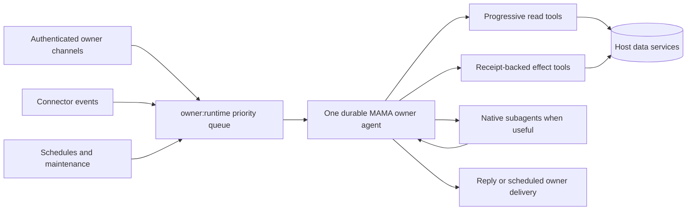

# One MAMA owner runtime

## Problem and root cause

The live `전체 보고 해줘` incident on 2026-09-06 proved that sharing the
`owner_console` role did not create one agent. The Telegram turn made 22 Code-Act calls and
returned an acknowledgement, while a host `report_request` relay moved the actual judgment to a
fresh, tool-free `operator:report` session. That session timed out and retried. A later policy
fingerprint change replaced the Telegram thread and restored both recent conversation and 29,920
characters of consumed report history, producing a 25,996-token system prompt before truncation.

The defect was architectural: transport channels, report kinds, event sources, and maintenance
kinds selected different model subjects. The front agent could therefore acknowledge work without
owning its completion.

## Contract

One MAMA is one accountable reasoning subject for the authenticated owner. It owns:

- one durable model thread and one serial priority queue;
- the active objective, follow-up state, verification, and final response;
- every decision to inspect, mutate, publish, answer, or use a subagent;
- direct use of the model runtime's native subagent facility when bounded parallel work helps.

A subagent is chosen and called by MAMA. It is not a channel, a report lane, a host `delegate`
function, or a replacement owner. MAMA gives it a bounded objective, monitors it, inspects its
evidence, and retains final judgment.

Host services own authentication, scope and destination enforcement, collection, indexing,
cursors, leases, retries, idempotency, and receipts. They do not create a second judgment subject.

## Implemented architecture

### TG-03/TG-04: one owner subject with agent freedom

- Authenticated Telegram, Slack, Discord, and Chatwork owner messages resolve to
  `owner_console` and the canonical `owner:runtime` session key.
- Owner events, reports, workorders, heartbeat, cron, and trigger maintenance call the same
  `AgentLoop` and use the same key.
- Direct owner turns have queue priority 100; background stimuli use priority 0.
- The host `delegate` and `report_request` tools and their executors are removed.
- Codex enables native multi-agent support, Claude exposes its native `Agent` tool, and Cline
  enables spawn/team support when the role permits `native_subagent`.
- Public/member roles block `native_subagent` and remain isolated from the owner subject.

### TG-05: continuation and bounded recovery

- Channel identity remains source, reply-target, and authority metadata; it does not choose the
  owner model session.
- Compatible live continuations inject no prior conversation, report body, or memory bundle.
- Per-turn envelope connector and destination changes no longer replace the owner thread. The
  stable owner role/model policy determines session compatibility while the current envelope
  still narrows each execution.
- After an actual missing or replaced backend thread, a local owner-runtime journal restores at
  most eight successful owner turns. Each prompt is capped at 600 characters and each response at
  900 characters. The journal file uses mode 0600.
- The journal is written only after a successful owner turn and is injected only by the backend's
  lazy replacement callback.

### TG-03/TG-05/TG-06: progressive evidence and reports

- The deleted report packet compiler and owner-report inbox can no longer duplicate large report
  bodies into the next prompt.
- A delivered report is marked consumed by `owner:runtime` immediately because the same subject
  composed it.
- Full-report requests use the ordinary owner turn and progressive tools. “Full” means complete
  decision coverage, with missing or partial coverage stated explicitly; it does not mean loading
  every task, card, or message at once.
- Reads begin with descriptors, counts, freshness, and coverage. MAMA follows a cursor only while
  that source can change its judgment.
- Scheduled delivery remains durable: exact text is reserved before transport, retry uses the same
  artifact, and scheduler credit advances only after confirmed delivery.

### TG-04/TG-06: no hidden judgment agents

- Automatic post-turn memory-agent model calls are removed. MAMA uses `mama_save` itself and a
  bounded deterministic owner-policy observer.
- Trigger author/review, general cron, heartbeat, owner-event, Board, Wiki, memory, and Temporal
  stimuli no longer create channel-specific or function-specific model sessions.
- Backend `AGENTS` files are not injected into the owner system prompt, preventing stale
  “sub-agent” and dispatcher identities from overriding MAMA's role.

## Runtime invariants

1. Every authenticated owner stimulus uses `owner:runtime`.
2. A channel may select delivery and authority; it may not select a different owner model.
3. Host retries replay deterministic input or the same delivery artifact; they do not commission a
   second opinion.
4. MAMA may call native subagents, but a subagent cannot own the owner conversation or declare the
   whole objective complete.
5. Every mutation and outbound delivery still requires host authority and a durable receipt.
6. Records, observations, memories, lessons, and open-ended principles are not executable tasks
   without finite `completion_criteria`.

## Completion gates

- A direct `전체 보고` produces a substantive judgment in that owner turn.
- No `operator:report`, `owner-event:<channel>`, or `operator:worker:*` model session is created.
- Cross-channel owner messages continue the same backend thread.
- A compatible continuation adds zero historical prompt text.
- A real replacement restores only the bounded owner-runtime journal once.
- Report/task/card/message discovery remains paged and coverage-aware.
- Owner messages enter the shared priority queue directly and run before queued background stimuli.
- Execution authority starts after both session/global waits; an issuance failure runs no model.
- The boot client forwards durable-session and recovery-journal capabilities.
- Due-bucket queries narrow rows before pagination, preserving a stable temporal observation time.
- Native subagent use is initiated and supervised by MAMA, with no host `delegate` function.
- Restart, timeout, failure, and retry preserve one accountable judgment subject.
- Kagemusha TG-03/TG-04/TG-05/TG-06 pass in code, then in an installed Telegram canary.

## Current evidence boundary

PR #267 merged as `c0312c43`; main CI, release and npm installation of 0.49.0 succeeded.
The installed Sol owner runtime recovered the on-demand report, performed direct task judgments,
committed the run and delivered once with `consumed_turn` attributed to `owner:runtime`.

That report used 41 outer Code-Act attempts (38 success, 3 failure), including 26 task-list calls
and four complete board traversals, over 612 seconds. Its first reclassification was call 26.
An unshipped automatic ten-call limit was withdrawn because it would block authorized actions and
also failed to cover Claude MCP. The 0.49.1 changes instead add selective due-bucket queries,
execution-time envelope issuance, direct owner priority admission and missing boot capability
forwarding. There is no automatic report tool-count cutoff.

Code, independent review, full tests, PR/CI, release, installation, and live proof remain distinct.
A new installed report, inbound owner follow-up on the same durable thread, and a native subagent
result integrated by that owner must be observed before the overall goal is complete.

0.49.1 verification: root build 2/2 and root tests 7/7 passed. Standalone ran 410 test files
with 5,509 passing tests and seven existing skips. Root lint, version-document synchronization,
changed-file formatting and diff checks passed. Independent queue review findings were repaired;
no P1/P2 remain. The Trello credential startup regression was restored using the established
start script; a live daemon Code-Act overview returned ten boards successfully. PR/CI and the
0.49.1 installed canary remain separate gates.

Installed local-candidate observation (2026-09-07): daemon Code-Act returned ten Trello boards,
124 active tasks and a matching upcoming subset of 19 (five rows requested/returned). One
on-demand report committed in 380 seconds using 28 outer calls (27 successful, one failed),
compared with the earlier 612 seconds / 41 calls. Task-list calls fell from 26 to seven, with
zero whole-board pagination loops in the observed report. Receipt 547 confirms one delivered
attempt, consumed by owner:runtime. These are different live windows, not a controlled benchmark.
The remaining failure was explicitly unsupported scoped checkpoint search, not Trello.

The changed tool contract triggered one expected policy replacement. The replacement's initial
session metadata contains one owner recovery block. Inspection also found that omitted background
model options and explicitly identical Telegram model options generated different fingerprints;
the final candidate now fingerprints the effective model, with a production-shaped failing-then-
passing regression. Root build and all seven root test tasks passed again after that correction.
This candidate is installed from a local tarball; public release and inbound Telegram/native-
subagent continuation are still unproven.

## Follow-up completion audit: 0.49.2

The channel/process audit confirmed one owner model subject, but found a remaining TG-05 breach:
`start.ts` called `ownerEventInbox.readPriorContext` on every event and the prompt builder copied
up to ten prior handled batches, including notification bodies, into a compatible continuation.
That automatic replay was inherited from the retired fresh owner-event sessions. The 0.49.2
change removes both the production read and the prompt's historical input/rendering. The inbox
storage and explicit audit reads remain; only genuine backend replacement uses the shared owner
journal. This is required before claiming the One MAMA goal complete.

The restart audit also found eager journal reads based on an empty in-memory SessionPool and a
compatible `thread/resume` policy callback that included recovery. Both now exclude history.
Backend missing/mismatch preflight (including a fresh Claude background process) and actual
replacement retries add the bounded journal exactly once, even without a caller prompt builder.
Cross-backend regression tests distinguish compatible restart from genuine loss explicitly.

0.49.2 local verification: root build 2/2 and root tests 7/7 passed; standalone completed 410
files with 5,517 passing tests and seven existing skips. Root lint, typecheck, version/doc sync
and diff checks passed. Independent review found no P1/P2 in event replay removal, actual-backend
recovery gating, or the deterministic idle-timeout test. Publication/installation and the real
Telegram follow-up remain separate completion evidence.

Telegram native-subagent proof was observed on installed 0.49.1: owner model run
`mr_3748a2b333034ea9aa57d2b81659fb7d` handled the actual incoming request, invoked native
`spawn_agent` then `wait_agent` on the same owner thread, and returned analysis plus MAMA's own
judgment. The Telegram message ledger confirms delivered, with no uncertain delivery. The
subagent used a full-history fork; 0.49.2 adds stable guidance to prefer bounded evidence and
no history fork when sufficient. This guidance is part of the owner policy fingerprint so each
backend adopts the genuine policy change once. A subsequent compatible restart must not replay
history. Public 0.49.2 installation remains the final runtime gate.
