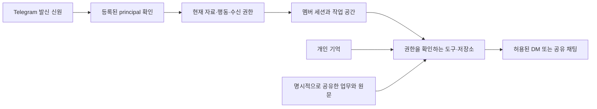

# Telegram 팀 멤버 등록·격리·권한 리서치

2026-10-06 · 공식 문서와 현재 `main`(81695ecbc)을 대조한 리서치. 구현·등록·배포 결과가 아니다.

목적은 INTENT.md의 다음 단계다. 여러 인증된 사람이 같은 MAMA를 쓰되 개인 기억과 공유 업무를 구분하고, 요청자·실행자·승인자·수신자를 남기며, 권한 변경이 실제 읽기와 실행에 반영되어야 한다. 오너는 첫 경로로 Telegram을 선택했다.

추천은 **같은 봇 + 멤버별 신원·세션·작업 공간 + 명시적으로 허용한 공유 자료와 행동**이다. 등록 승인은 대화할 자격을 주고, 자료 공유와 실행 권한은 별도로 부여한다. 모델에게 상대의 자료를 보지 말라고 지시하는 것으로 격리를 대신하지 않는다. 아래 추천은 설계 제안이며, 외부 프로젝트의 문서가 MAMA 구현의 안전성을 증명하지는 않는다.

| 프로젝트                         | 사람을 추가하는 방식                                                              | 권한·격리 방식                                                                                                         | MAMA에서 참고할 부분과 한계                                                                                                                                                              |
| -------------------------------- | --------------------------------------------------------------------------------- | ---------------------------------------------------------------------------------------------------------------------- | ---------------------------------------------------------------------------------------------------------------------------------------------------------------------------------------- |
| OpenClaw                         | 미등록 DM 발신자에게 페어링 코드를 주고 운영자가 승인. DM 접근과 그룹 접근은 별도 | DM 세션을 발신자별로 나눌 수 있고 도구 정책을 설정. 팀 모드는 한 gateway의 신뢰 영역 안에서 협업                       | 등록 UX와 Telegram sender 정책을 참고. 공식 multi-user 문서는 세션 소유권·UI 필터를 보안 경계로 보지 않으며, 같은 에이전트를 운영하는 사람들은 그 에이전트의 권한을 공유한다고 명시한다. |
| NanoClaw                         | 채널별 사용자 신원, `owner`/`admin` 역할, agent-group 멤버십을 각각 등록·부여     | 세션별 컨테이너와 그룹별 작업 폴더·공유 기억. 멤버십은 접근, 역할은 관리 권한. credential gateway와 마운트 경계도 별도 | 사람의 역할과 그룹 접근을 구분하는 구조, 실행체 격리를 참고. 같은 그룹의 세션들은 그룹 기억을 공유하므로 개인 기억 격리와 같지 않다.                                                     |
| Letta                            | 조직 이메일 초대 수락 후 기본 Editor. Admin이 역할 변경                           | 에이전트와 대화는 기본 개인 소유. 공유 에이전트에도 각 사람의 대화는 별도. Admin은 조직 전체 접근 가능                 | 같은 에이전트를 여러 사람이 쓰는 UX와 대화 소유권을 참고. 장기 기억은 agent 단위 MemFS이므로 개인 대화 열람 격리를 사람별 기억 격리로 가정하지 않음. 도구 실행 허용도 별도다.            |
| LibreChat                        | 로컬/연합 로그인 계정, 그룹·역할. 리소스 소유자가 사용자·그룹별 공유 권한 부여    | 기능별 권한, 리소스 ACL, 관리 권한을 구분. 리소스 권한은 Viewer/Editor/Owner                                           | 무엇을 할 수 있는지와 어느 자료에 할 수 있는지를 구분하는 모델을 참고. 설정 화면을 숨겨도 에이전트 답변을 통해 첨부 자료가 노출될 수 있다고 문서가 경고한다.                             |
| LangGraph / LangSmith Deployment | 애플리케이션이 인증된 최종 사용자의 신원을 서버에 전달                            | thread는 서버의 owner metadata/filter, 장기 기억은 인증 신원이 포함된 namespace로 격리. 각각 별도 설정 필요            | 동일 엔진을 쓰면서 개인 대화와 기억을 별도로 구분하는 구현 패턴. 공용 API key만 쓰면 최종 사용자의 신원이 구분되지 않는다.                                                               |

표의 근거: [OpenClaw pairing](https://docs.openclaw.ai/channels/pairing), [OpenClaw multi-user](https://docs.openclaw.ai/concepts/multi-user), [OpenClaw Telegram 접근 제어](https://docs.openclaw.ai/channels/telegram/access-control), [OpenClaw DM 세션](https://docs.openclaw.ai/concepts/session), [NanoClaw 사용자·역할·멤버 CLI](https://docs.nanoclaw.dev/operate/ncl-cli), [NanoClaw 보안 모델](https://docs.nanoclaw.dev/concepts/security), [Letta 초대](https://docs.letta.com/teams/collaborators), [Letta 권한](https://docs.letta.com/teams/permissions), [LibreChat 접근 제어](https://www.librechat.ai/docs/features/access_control), [LangGraph 인증](https://docs.langchain.com/langsmith/custom-auth), [thread 격리](https://docs.langchain.com/langsmith/resource-auth), [기억 격리](https://docs.langchain.com/langsmith/store-auth).

**등록에서는 기존 MAMA 결정부터 이어야 한다.** 개발 메모리 `p2a_principal_registry_plan`(2026-08-15)은 오너가 시작하는 등록을 선택했다. 오너가 전달한 Telegram 메시지의 `forward_origin.sender_user.id`에서 호스트가 신원을 확인하고 후보를 등록하는 방식이었다. 발신자 정보가 숨겨진 전달은 등록할 수 없다는 제약도 명시했다. 현재 제품에는 그 후보 등록 경로가 연결되어 있지 않다. 이 과거 선택을 새로운 공개 가입 정책으로 조용히 바꾸지 않는다.

비교할 등록 경로는 두 가지다.

1. **기존 선택을 복원:** 오너가 멤버의 메시지를 전달하고, 호스트가 전달 원본의 사용자 ID를 확인한다. 오너가 시작하는 흐름을 유지한다. 숨김 전달에는 쓸 수 없고, 표시 이름을 실제 사용자 ID처럼 쓰면 안 된다.
2. **오너 초대 링크 후 승인:** 오너가 일회성 초대를 만들고, 멤버가 봇 DM에서 수락하면 Telegram 발신 신원을 확인한 뒤 오너가 최종 승인한다. 숨김 전달 없이도 신원을 확인할 수 있다. 링크를 전달받은 다른 사람이 열 수 있으므로 링크 소지만으로 자료·관리 권한을 주지 않는다. 이 경로는 기존 결정과 비교해 선택할 제안이다.

OpenClaw의 미등록 DM 페어링은 봇과 대화할 발신자를 확인하는 패턴이다. NanoClaw의 Telegram 설치 페어링은 채팅·사용자를 등록하고, 설치에 오너가 없으면 첫 페어링 사용자를 오너로 승격한다. **이 초기 설치 규칙을 운영 중인 MAMA에 이식하면 안 된다.** 현재 운영 DB의 `principals`와 활성 `principal_scope_grants`는 모두 0건이지만, 제품은 별도의 오너 설정과 고정 principal `owner`로 실제 운영 중이다. 빈 레지스트리가 오너 부재를 뜻하지 않는다. 근거: [NanoClaw Telegram](https://docs.nanoclaw.dev/channels/telegram), [MAMA 오너 ID](../../../packages/standalone/src/cli/commands/daemon.ts#L65).

Telegram은 `start` 인자가 있는 봇 링크를 지원한다. 초대 링크는 신원 확인 흐름의 입구로 사용할 수 있고, 공유 리소스 권한 그 자체로 취급하지 않는 것이 위 추천이다. [Telegram deep linking](https://core.telegram.org/bots/features#deep-linking)

**현재 MAMA에서는 저장 기능과 실제 수신·실행 경로를 구분해야 한다.**

| 현재 근거                                                 | 확인한 동작                                                                                    | 팀 멤버 추가 전에 필요한 작업                                                                      |
| --------------------------------------------------------- | ---------------------------------------------------------------------------------------------- | -------------------------------------------------------------------------------------------------- |
| `telegram.ts:356–378`                                     | 허용된 오너 발신자만 받으며 비오너는 드롭                                                      | Telegram 신원을 확인한 뒤 오너와 활성 멤버를 각각 해석. 멤버를 `ownerUserIds`에 넣어 우회하지 않음 |
| `stimulus-delivery.ts:193–221`                            | intake를 만든 principal로 모든 입력을 저장                                                     | 실제 발신 principal과 응답 목적지를 호스트가 확정                                                  |
| `stimulus-delivery.ts:659`                                | 모든 턴이 `owner:runtime` 세션 사용                                                            | 개인 DM은 principal별, 공유 채팅은 명시한 공유 범위별 세션                                         |
| `native-session.ts:438–443`                               | 기본 실행 권한과 준비 권한이 오너로 고정                                                       | 큐 대기 뒤 실제 호출자의 현재 권한을 준비하고 부모·하위 호출에 전달                                |
| `action-surface.ts:358–361`                               | 도구 dispatch에도 오너 권한을 넣음                                                             | caller grant가 도구까지 도달하도록 구성. 요청 JSON이 principal이나 권한을 바꾸지 못하게 함         |
| `principal-repository.ts:41–68, 316–345`                  | 등록·신원 연결·중지·퇴장·source/memory grant 저장/철회 API 존재. active member/owner 조건 확인 | 공개 core API를 제품 수신·관리 흐름에 연결. 기존 오너 ID·기록의 소유권을 보존해 먼저 연결          |
| `dispatch.ts:105–148`, `memory/api.ts:929–957`            | action 허용 목록과 connector 권한 검사, 허용 밖 기억 scope 거부                                | 실제 member access로 검색·원문·그래프·파일·도구 경로 모두 확인                                     |
| `stored-source-reader.ts:63–72`, `drive-actions.ts:62–70` | 저장 원문은 비오너 channel grant 필요. Drive live read는 명시적으로 owner-only                 | 첫 멤버의 자료 범위를 실제 지원하는 source부터 정함. Drive 파일 접근을 자동으로 확대하지 않음      |
| `native-session.ts:178–215`, `backend-security.ts:18–31`  | 현재 native driver는 오너 workspace와 credential deny 경계를 구성                              | 멤버 실행에 오너 작업 공간·원장·파일을 그대로 노출하지 않도록 별도 실행 경계를 검증                |

source/memory grant 저장과 실행 권한 저장은 같은 기능이 아니다. 현재 `PrincipalScopeGrantRef`는 source와 shared-memory 범위를 표현하고, `JudgmentAccess`는 별도로 `actions`, `readScopes`, `channels`, `destinations` 등을 가진다. 어떤 자료를 읽고, 어떤 기록을 쓰고, 어떤 행동을 실행하고, 어디로 보낼 수 있는지를 제품이 합성해야 한다. 기존 액션 카탈로그에는 멤버 관리 등록이 연결되어 있지 않다. [principal 저장 계약](../../../packages/mama-core/src/identity/principal-repository.ts#L15), [실행 권한 계약](../../../packages/mama-core/src/knowledge/judgments.ts#L37), [현재 제품 등록 지점](../../../packages/standalone/src/runtime/action-surface.ts#L201)

**권장 구조는 동일한 MAMA 경험을 유지하면서 내부 경계를 분리하는 것이다.**

- **개인 대화와 기억:** 각 principal의 대화·개인 기억·임시 파일을 분리한다. 오너의 세션 시작 이력, 교정, 보고서와 작업 파일을 멤버에게 통째로 넣지 않는다. 공유 규칙과 개인 교정도 구분한다.
- **공유 업무:** 오너가 허용한 프로젝트·채널·업무 기록을 공통 원장에서 조회한다. 개인 원문이 섞인 기록을 단순히 같은 봇이나 같은 그룹이라는 이유로 공유하지 않는다. 자료를 공유한다는 판단과 허용 범위의 실행은 구분한다.
- **도구:** 기능 허용과 자료 범위를 함께 검사한다. 멤버에게 조회만 줄지, 허용한 업무의 수정·파일 작업까지 줄지는 부여한 권한으로 결정한다. 관리 작업은 기존 오너의 명시적 요청 경계를 유지한다. 오너의 기존 권한은 축소하지 않는다.
- **파일·프로세스:** DB 조회가 걸러져도 native shell/read가 원장이나 오너 파일을 직접 열면 격리가 무너진다. 멤버별 프로세스와 읽을 수 있는 파일 경계를 검증하고, 필요하면 NanoClaw처럼 컨테이너에 허용한 경로만 마운트한다. 컨테이너를 쓴다는 이유로 같은 그룹의 공유 기억까지 개인별이라고 가정하지 않는다.
- **답변 목적지:** DM에서 허용된 개인 자료를 그룹에 답하면 읽기 권한이 있어도 다른 사람에게 노출된다. 개인 답변과 그룹에 공유할 자료를 구분한다. 그룹 답변은 명시한 그룹 공유 범위로 만들고, private 답변은 해당 멤버 DM으로 보낸다.
- **철회:** 다음 요청·도구 호출에서 최신 권한을 확인한다. 이미 취소한 자료가 들어간 모델 세션·요약·파일 캐시를 계속 재사용하지 않는 경로가 필요하다. 권한 변경 시 세션을 새로 시작하거나 더 강하게 분리하는 방식을 설계한다. 이미 인간에게 전달된 사본까지 회수된다고 주장하지 않는다.
- **귀속:** 하나의 에이전트 이름과 실행자·요청자·승인자·수신자를 혼동하지 않는다. 사람의 요청으로 생긴 수정과 오너 승인, 실제 전달을 각각 추적한다.

위 구조는 문서들을 조합한 MAMA용 제안이다. 특히 철회 후 모델 문맥·파일 캐시 처리와 그룹의 공개 범위는 별도 설계·실측이 필요하다.

접근 방식별 판단은 다음과 같다.

| 접근                                          | 장점                                                                       | 목적과의 충돌·비용                                                                             |
| --------------------------------------------- | -------------------------------------------------------------------------- | ---------------------------------------------------------------------------------------------- |
| 오너 허용 목록에 팀원을 추가                  | 가장 적은 수정                                                             | 현재 코드에서는 오너 principal·권한·세션을 공유한다. 개인 기억·제한된 권한이라는 INTENT와 충돌 |
| 같은 봇, principal별 실행과 명시적 공유 범위  | 같은 MAMA에 자연스럽게 요청하면서 개인·공유 상태 구분. 기존 core 계약 활용 | 수신→세션→권한→도구→파일→전달 전체 연결이 필요. **권장**                                       |
| 사람/조직마다 독립 gateway·credentials·저장소 | 신뢰하지 않는 사용자 간 실행 경계를 더 강하게 분리                         | 공통 업무·교정·이력 연결 비용이 커짐. 외부 조직·상호 불신 사용자를 받을 때 검토                |

**첫 실제 멤버 검증은 등록보다 권한 변경이 행동에 반영되는지까지 봐야 한다.**

1. 기존 오너 신원을 보존·연결한 뒤 실제 팀원 한 명을 등록한다. 임의 이름이나 사용자가 말한 ID로 다른 사람을 등록하지 않는다.
2. 팀원은 같은 봇 DM에서 대화하고 개인 기억을 남긴다. 오너의 개인 기억과 다른 멤버의 자료는 검색·직접 ID 조회·링크 따라가기·파일 읽기에서 보이지 않아야 한다.
3. 오너가 실제 채널·공유 업무와 행동 범위를 부여한다. 팀원은 그 자료로 실제 질문을 답하고, 수정 권한을 받았다면 허용한 업무를 수행한다. 없는 권한은 실행 전에 거부되어야 한다.
4. 공유 범위를 벗어난 원문·그래프·파일·전달 대상을 지정해도 범위가 넓어지지 않는지 본다. 오너의 정상 업무 권한은 유지되어야 한다.
5. 오너가 권한을 철회한 뒤 같은 질문을 기존 대화에서 반복한다. 예전 답·요약·다운로드나 하위 에이전트가 철회한 권한을 되살리지 않아야 한다.
6. 재시작 뒤에도 등록·개인 기억·공유 권한·철회가 유지되는지 확인하고, 요청자·실행자·승인자·수신자와 전달 기록을 대조한다.

다음 설계에서 정할 것은 등록 경로(기존 전달 기반 또는 오너 초대 링크), 첫 멤버의 실제 자료·행동 범위, native 실행 격리 수단이다. 첫 멤버를 읽기 전용 사용자로 영구 제한하거나, 모든 쓰기에 새 승인 절차를 붙이는 결정은 이 리서치에서 하지 않았다.

Letta를 더 자세히 확인하면서 추가한 구분은 **conversation 열람 권한과 agent 장기 기억의 소유권이 다르다**는 점이다. 공식 [conversations 문서](https://docs.letta.com/concepts/conversations)는 하나의 agent에 속한 여러 대화가 동일한 정체성과 장기 기억을 사용한다고 설명한다. [MemFS](https://docs.letta.com/concepts/memfs)는 agent 소유 Git 저장소이며, 대화별 개인 저장소라는 계약이 아니다. 공유 agent의 사용자별 장기 기억 ACL이 보장된다고 이 문서들로 주장할 수 없다.

다른 구조로는 각자의 private agent/MemFS를 유지하고, 여러 agent에 조직 소유 [shared-memory repository](https://docs.letta.com/concepts/shared-memory)를 명시적으로 붙이는 방식이 있다. 개인 agent 기억과 공통 지식의 소유권을 구분할 수 있지만, org Admin의 전체 agent/conversation 접근 권한이라는 예외는 남는다. MAMA의 오너에게도 다른 멤버의 개인 대화·기억을 자동으로 열 것인지는 별도 정책 결정이다.

Letta의 [로컬 도구 권한](https://docs.letta.com/configuration/permissions) 또한 조직 역할과 별개다. `standard`/`acceptEdits`/`unrestricted`/`strict` 모드와 호출 패턴별 allow/deny가 있고, 다른 agent의 기억 디렉터리를 막는 guard도 있다. 그 guard는 agent 경계이므로 동일 agent를 쓰는 서로 다른 사람의 개인 기억 격리를 증명하지는 않는다. 여기까지는 공식 문서의 계약을 분석한 것이며 실제 다중 사용자 누출·철회 실험을 수행한 결과가 아니다.

오너가 이어서 제안한 방향은 **각자 개인 에이전트 세션을 가지고, 공유 채널에서는 공유 에이전트를 쓰는 방식**이다. 이를 다음 설계의 방향으로 기록한다. 아직 구현 spec이나 실행 계획의 승인은 아니다.

| 사용 위치 | 에이전트 문맥                  | 기억·파일의 기본 경계                                |
| --------- | ------------------------------ | ---------------------------------------------------- |
| 개인 DM   | 해당 principal의 개인 에이전트 | 그 사람의 개인 기억·대화·작업 파일, 허용된 공유 업무 |
| 공유 채널 | 해당 채널의 공유 에이전트      | 그 채널에 허용한 공유 기억·대화·작업 파일            |

허용된 프로젝트의 업무와 수정 이력은 공통 원장을 사용한다. 에이전트별로 같은 업무를 중복 생성하지 않으며, 개인 문맥 전체를 공유 문맥으로 복사하지 않는다. 공유 채널의 agent가 수행하는 인간 요청에도 요청자 신원과 행동 권한을 유지한다. 공유 agent의 권한으로 멤버의 권한을 승격하지 않는다.

현재 확인할 정책은 개인 DM에서 전달한 업무 진행·피드백을 (1) 허용된 업무 기록에 한해 자동 반영할지, (2) 공유를 요청할 때만 반영할지다. 개인 대화·기억 전체 공개와 허용된 업무 기록 업데이트는 다른 동작이다. 이 선택은 아직 열려 있으며, 개인 자료에 대한 오너의 열람 범위와 공유 채널의 참여·읽기 범위도 구현 전에 명시해야 한다.

오너는 이어서 개인 에이전트와 공유 에이전트의 역할도 달라야 하며, 자신의 업무와 공통 업무·공지를 구별해야 한다고 명시했다. 개인 에이전트는 본인의 업무 계획·진행·피드백·실행과 개인 기록을 돕고, 공유 에이전트는 허용된 팀 업무의 전체 상태·연결·조정과 공지를 담당하는 방향이다. 같은 기능에 세션 ID만 다르게 붙이는 설계가 아니다.

설계에서 업무도 구분한다. 개인 전용 업무와 개인 메모는 개인 범위에 남는다. 공동 프로젝트 안에서 본인이 맡은 업무는 공유 업무 원장의 동일한 작업을 개인 관점으로 다루며, 팀 현황에도 연결한다. 공통 업무·공지는 공유 범위에서 유지한다. 본인의 사적 메모를 공동 작업의 진행 상태와 혼합하거나, 개인·공유 에이전트가 같은 공동 작업을 별개 작업으로 복제하지 않는 것이 제안이다.

예를 들어 공유 에이전트가 팀의 제출 일정을 정리하면, 개인 에이전트는 허용된 담당 업무에 미치는 영향을 판단해 본인의 작업을 돕는다. 해당 공동 작업의 완료·제출 기록이 갱신되면 공유 에이전트는 그 기록으로 팀 현황을 갱신한다. 역할은 이 흐름을 정하지만, 실제 행동과 전달은 요청자의 권한·업무 범위·수신 대상 권한을 따르며 공유 에이전트라는 이유로 관리 권한을 얻지 않는다. 개인 DM에서 무엇을 자동 공유 기록으로 반영할지에 관한 앞선 질문은 이 역할 구분만으로 답했다고 간주하지 않는다.

오너가 명시한 개인 에이전트의 핵심 효용은 **공통 기억을 기반으로 개인의 업무 우선순위를 알려주는 것**이다. 개인 기록만으로 일정을 정리하는 것이 아니라, 허용된 공통 기억의 진행 상황·결정·피드백·마감·선행 작업과 본인의 담당 업무·진행·가용 시간·선호를 함께 읽고 업무 순서를 판단해야 한다. 중요도 판단과 이유는 에이전트가 맡으며, 호스트에 고정 점수나 의미 분류 규칙을 넣는 방향이 아니다.

개인에게 전달할 결과는 무엇을 먼저 해야 하는지, 그 이유와 공통 근거, 무엇이 막혀 있고 누구와 조정해야 하는지, 이전 제안 이후 무엇이 달라졌는지를 포함한다. 예를 들어 공통 마감 변경이나 선행 작업 지연이 본인의 다음 작업 순서를 바꾸는지 판단하고, 가능한 준비 작업과 확인 요청을 제안한다. 개인 사정은 판단에 사용하되 공유 채널에 자동 공개하지 않는다.

다음 실사용 설계의 성공 질문은 "공통 진행 상황을 보고 내가 오늘 무엇부터 해야 하는지, 왜 그런지 알려줘"다. 정답은 단순한 개인 할 일 목록이나 공지 복사가 아니라 공통 상태를 근거로 한 본인의 우선순위와 실행 가능한 다음 행동이어야 한다. 이 추천이 공통 업무 기록의 우선순위·담당자를 자동 변경하는 권한을 뜻하지는 않는다. 개인 DM에서 공유 업무를 갱신하는 정책은 앞선 미결정 항목으로 유지한다.

Letta 프로젝트 전체를 비교할 때는 최신 구현과 과거 API 서버를 구분해야 한다. [현재 공식 저장소](https://github.com/letta-ai/letta)는 활성 구현을 `letta-code`로 안내하며 V1 API 서버를 `archive`에 보관한다. MemGPT에서 시작해 현재는 지속되는 신원·기억·도구·대화를 가진 agent harness, CLI/앱, Agent SDK와 로컬·원격·클라우드 실행을 제공하는 범용 플랫폼으로 설명한다. [현재 프로젝트](https://docs.letta.com/), [Agent SDK](https://www.letta.com/agent-sdk/), [MemGPT 논문](https://arxiv.org/abs/2310.08560)

| 비교 축            | 현재 Letta 공식 문서                                                             | MAMA의 현재 구현·목적과 설계 방향                                                                    |
| ------------------ | -------------------------------------------------------------------------------- | ---------------------------------------------------------------------------------------------------- |
| 지속되는 중심 단위 | Agent의 신원·MemFS·모델/도구 설정·여러 conversation                              | 실제 업무와 수정 이력·원문·판단 링크를 공통 근거로 유지하고 이를 읽는 지속 에이전트                  |
| 장기 기억          | agent 소유 Git/Markdown MemFS, 필요할 때 파일 읽기. 별도 mod로 검색 확장         | SQLite 기록·수정·근거·링크와 lexical/vector 검색, 사람이 읽는 위키                                   |
| 경험 반영          | agent가 기억을 수정·commit하고, 설정한 dreaming으로 최근 대화의 교훈 정리        | 오너 교정의 범위와 근거를 남기고 다음 관련 판단·행동이 실제로 달라지는지 확인                        |
| 실행·배포          | SDK local/remote/cloud, 연결된 컴퓨터 또는 cloud sandbox에서 도구 실행           | 현재 로컬 데몬과 native Claude/Codex 경로, action catalog·scope·실행/전달 기록                       |
| 공유 지식          | 여러 cloud agent에 조직 소유 Git repository를 attach                             | 같은 업무를 중복 생성하지 않는 공통 업무 원장과 허용된 공유 기억·원문                                |
| 제품 기능          | 코딩·개인 비서·메신저 동료 등 여러 유형의 agent를 구성                           | 실제 대화/업무 도구를 관찰해 업무 인식·귀속·이력·답변·보고·교정으로 연결하는 운영 제품               |
| 팀의 현재 상태     | 조직 역할, agent 공유, 개인 conversation, shared-memory repository를 문서상 지원 | 현재 운영은 오너 흐름. 사람별 개인 agent와 채널별 공유 agent, 공통 기억 기반 개인 우선순위는 설계 중 |

이 표는 공식 자료와 현재 MAMA 코드·INTENT를 대조한 분석이다. Letta로 업무 원장이나 유사 사례 검색을 만들 수 없다는 주장이 아니며, 기본 Agent 상태·기억·실행 기반과 MAMA가 제품 중심에 둔 업무 기록 구조의 차이를 설명한다. 실행 기술로서 Letta는 `mama-core`와, 사용자 제품으로서 앱·메신저 동료는 `mama-os`와 각각 비교해야 한다. MAMA의 설계 목표를 이미 실현된 팀 기능처럼 표시하지 않는다.

기억과 실행 부분의 근거: [stateful agent](https://docs.letta.com/concepts/stateful-agents), [MemFS](https://docs.letta.com/concepts/memfs), [dreaming](https://docs.letta.com/configuration/memory), [cloud 실행](https://docs.letta.com/platform/cloud-agents), [shared memory](https://docs.letta.com/concepts/shared-memory), [MAMA INTENT](../../../INTENT.md).

Letta에서 배울 우선순위는 문서로 확인되는 제공 기능과 현재 MAMA의 연결 지점에서 판단한다. 답변 정확도·학습 효과·지연·비용의 우열은 비교 실험을 하지 않았으므로 판정하지 않는다. Agent의 지속 상태와 conversation/computer를 구분한 제품 모델, 검사하고 갱신할 수 있는 기억, dreaming의 경험 정리 흐름, 팀 권한, 애플리케이션용 SDK와 클라우드 실행은 참고할 제공 범위다.

MAMA에 먼저 적용할 후보는 (1) 사람별 개인 Agent와 채널별 공유 Agent의 신원·문맥·기억을 native session과 구분, (2) 실제 요청자와 현재 source/action/destination 권한을 도구까지 전달, (3) 개인·공통 규칙이 어떤 근거로 저장되고 다음 관련 업무에 사용되는지 관측 가능하게 하는 것이다. 현재 `native-session.ts:438–443`, `stimulus-delivery.ts:659`, `action-surface.ts:358–361`의 오너 고정 경로가 첫 멤버 흐름을 위해 바뀌어야 하는 구체적 근거다. 개인 우선순위의 유용성은 허용된 공통 업무 기억을 실제로 읽어 다음 행동을 설명하는 것으로 검증한다.

기억의 소유권·색인·검사 UX는 배우되, MAMA의 업무 이력과 원문 근거는 기존의 구조화된 기록으로 유지하는 방향이다. 외부 소비자가 일관된 이벤트와 실행 결과를 받는 표면은 기존 core 계약을 바탕으로 검토한다. 관리형 클라우드·실행 컴퓨터 이동은 첫 멤버의 권한과 역할을 확인한 뒤의 별도 범위다. Letta의 모든 실행 모드·자동 회고·관리자 전체 열람을 일괄 도입하자는 제안은 아니다.

축적되는 기억의 처리도 현재 Letta Code 문서를 기준으로 구분한다. [Conversations](https://docs.letta.com/concepts/conversations)는 문맥 한도에 가까워지면 오래된 대화를 자동 요약하고 최근 메시지를 유지하되, 원문 이력을 검색할 수 있게 남긴다고 설명한다. 요약에는 정확한 문구나 근거가 빠질 수 있다. 대화 압축과 장기 기억 저장은 서로 다른 동작이다.

[MemFS](https://docs.letta.com/concepts/memfs)는 루트 파일을 매 턴 읽고, 상세 기억은 `MEMORY.md` 색인으로 안내하는 하위 디렉터리에 두어 필요할 때 읽는다. 기본은 파일 검색이며 벡터 색인은 기본 내장되지 않는다. 선택적 MemFS Search mod의 의미·혼합 검색에는 QMD 설치와 색인이 필요하다. 대화 이력 검색은 별도이며 cloud는 full-text/vector/hybrid, local은 현재 full-text다.

[Memory & dreaming](https://docs.letta.com/configuration/memory)의 설정된 dreaming은 최근 대화에서 교훈을 정리한다. `/doctor`는 파일 배치·중복·system prompt 토큰을 검사하고, 큰 정리는 저장소를 백업한 뒤 파일 분할·중복 병합·계층 재구성을 수행한다. Git 이력과 memory subagent의 worktree는 변경 추적·병렬 정리를 지원한다. 조직 공유 자료는 [shared repository](https://docs.letta.com/concepts/shared-memory)를 attach하고 commit/push/pull로 동기화한다.

이 방식은 누적 보관량과 매 턴 읽는 양을 분리한다. 문맥 압축이 저장량 증가를 없애거나 검색 정확도·대규모 지연을 보장한다고 해석하지 않는다. MAMA가 참고할 점은 원문·업무 수정 이력을 보존한 채 요약·색인·자주 쓰는 규칙을 관리하는 것이다. MAMA의 삭제·자동 회고·저장 형식 변경을 승인한 결정은 아니다.

Letta의 한계도 공식 제약과 구조적 추론을 구분한다. 확인된 계약은 요약의 문구·출처 누락 가능성, MemFS의 기본 벡터 색인 부재, 매 턴 루트 파일 로딩, dreaming/review의 추가 모델 사용, 공유 저장소의 commit/push/pull 동기화와 cloud-only 제공, agent 단위 장기 기억, Admin의 모든 agent/conversation 열람이다. [대화](https://docs.letta.com/concepts/conversations), [MemFS](https://docs.letta.com/concepts/memfs), [기억 정리](https://docs.letta.com/configuration/memory), [공유 기억](https://docs.letta.com/concepts/shared-memory), [팀 권한](https://docs.letta.com/teams/permissions)

여기서 추론되는 위험은 필요한 파일 탐색 누락, 잘못된 교훈의 재사용, 루트 기억 증가에 따른 매 턴 입력 증가, 동기화 전 서로 다른 업무 상태를 읽는 것, Git 병합 후에도 남을 수 있는 업무 의미의 충돌이다. 사용자별 conversation 비공개가 공유 agent의 사람별 장기 기억 격리를 증명하지도 않는다. 이 위험들은 재현한 Letta 버그나 성능 열위 판정이 아니다. MAMA도 실제 조회·정정 적용·현재 권한·답변 결과로 확인해야 한다.

업무별 변경·원문 근거·유효 시점·요청/승인/전달을 일관되게 다루는 모델은 MemFS 위에 별도 설계할 부분이다. 파일의 Git 이력은 유용하지만 그러한 업무 계약을 자동으로 충족한다고 간주하지 않는다. 개인 우선순위를 공통 상태에서 판단하려면 공유 기억의 최신성·읽기 권한과 개인 정보의 공유 범위를 함께 설계해야 한다.

오너는 비교의 전제를 **모델은 발전하며, 에이전트의 문제와 프로그램의 문제를 구분해야 한다**고 정했다. 앞선 답변의 누락·교정 적용·검색·보고 사례를 그대로 프로그램 결함 목록으로 분류한 것은 수정한다. 에이전트가 더 정확히 판단하고 도구를 사용해도 남는 신원·저장·권한·조회·실행·복구의 구조적 제약을 프로그램 비교의 중심에 둔다.

| 관찰                                                  | 분류 기준                                                                                                                                                                                                                 |
| ----------------------------------------------------- | ------------------------------------------------------------------------------------------------------------------------------------------------------------------------------------------------------------------------- |
| 원장에 있는 후반 교환을 답변에서 누락                 | 에이전트가 정상 도구로 원문을 읽을 수 있었는지, 실제 반환에 있었는지 확인한다. 도구가 제공했는데 누락하면 판단·탐색 문제이고, 자료·조회 경로가 끊겼다면 프로그램 문제다. 원장에 있다는 사실만으로 원인을 확정하지 않는다. |
| 규칙 색인을 받은 14 기록 턴이 본문을 열지 않음        | 관련 색인·본문 조회가 정상 제공되었는데 읽지 않은 행동과, 호스트가 색인·저장 규칙을 제공하지 못한 결함을 구분한다. 저장 성공만으로 적용을 입증하지도 않는다.                                                              |
| 단어가 겹치지 않는 네 표현의 검색 실패                | 검색 질의 선택과 추가 탐색 중단, 임베딩 모델 품질, 호스트 색인·필터·검색 경로를 분리한다. 직접 도구 입력·반환과 원문으로 원인을 확인하기 전에는 혼합 원인으로 남긴다.                                                     |
| 41/41 행·마감이 맞지만 새 교환을 "변경 없음"으로 설명 | 최신 자료가 반환됐는데 해석을 틀린 경우와, 호스트가 낡은 상태·잘못된 범위·불완전한 자료를 반환한 경우를 나눈다. 보고 문장의 오류만으로 저장·투영 결함을 확정하지 않는다.                                                  |

현재 확인된 프로그램 과제는 `main` 81695ecbc의 `native-session.ts:442–443`와 `action-surface.ts:361`이 오너 권한을 넣는 실행 경로다. 더 강한 모델이 와도 이 경로가 멤버 신원·현재 grants를 대신 전달하거나 개인·공유 에이전트의 native 실행 경계를 만들어 주지는 않는다. core principal/grant 기능을 실제 ingress/session/tools/files/delivery에 연결해야 한다. 아직 팀 기능을 제공하지 않은 상태이며, 존재하는 core 기능의 결함과 혼동하지 않는다.

`stimulus-delivery.ts:582–597`이 native 압축을 관찰하지 못하고 하루 안의 교훈 재첨부를 억제하는 것은 프로그램의 관측 제약이다. 관련 규칙의 색인·조회 도구가 계속 제공된다면 강한 에이전트가 다시 읽을 수 있으므로, 이 제약만으로 교정 유실을 확정하지 않는다. 프로그램 평가는 자료·규칙을 다시 읽을 수 있는 계약과 실제 도구 결과를 확인한다.

Letta와 MAMA의 프로그램 비교는 데이터 소유권과 격리, 원문·수정 이력 보존, 조회 가능성, 권한 집행, 동시 수정·재시작·전달 복구, 모델·임베더 교체의 계약과 실제 성능을 기준으로 한다. 누적 기억의 판단 품질이나 모델의 도구 선택 실수를 프로그램의 고유 열위로 합산하지 않는다. 다중 멤버·대규모 운영 증거가 부족한 것은 미확인으로 남긴다. C2/C5 오너 수용과 모니터링 중지는 유지하며 구현·배포 승인은 아니다.

그 기준으로 [프로그램 구조를 다시 조사했다](letta-mama-program-comparison.md). 새 시험 DB에서 모델 호출 없이, 다른 scope 기록 25개 때문에 허용된 한 기억이 벡터 후보에서 사라지는 문제를 두 번 재현했다. 오너 고정 실행은 팀 기능 연결 과제로, embedder API 주입의 불완전함은 계약 제약으로, vector 전체 적재·순회는 규모 위험으로 분리한다. 기존 권한·세션·native 복구와 업무 revision 테스트 59개는 통과했다. 답변 누락이나 규칙 미조회는 프로그램 결함으로 합산하지 않으며, 코드는 수정하지 않았다.

오너의 마지막 지적은 전체 분석이 계속 단편적이어서 팀 멤버 플랜을 진행할 수 없다는 것이다. 이 문서와 비교 보고서는 조사 메모이며 구현 계획의 완성 근거가 아니다. 다음 재개는 등록·신원부터 개인/공유 기억, 현재 권한, 실행·업무 반영·전달, 회수·재시작까지 한 흐름으로 분석한다. 20개 후보 예산 자체를 문제로 삼거나 새로운 제한으로 해결하지 않으며, 검색 재현을 전체 설계의 결론·필수 선행 수정으로 확대하지 않는다. 구현 spec·실행 계획은 아직 없다.
